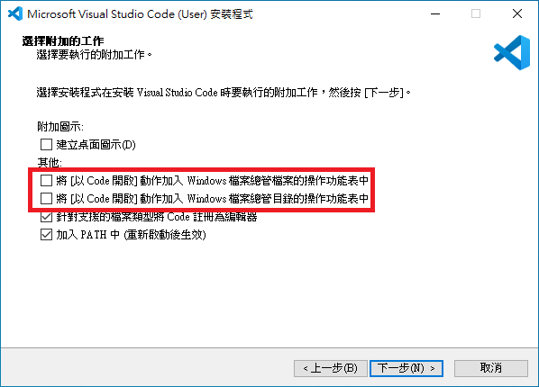
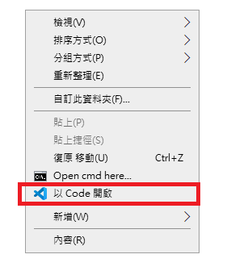

## 準備環境

### 安裝C++編譯器

關於安裝編譯器的問題之前已經有文章說過了  
傳送門🚪：[在Windows安裝C/C++ Compiler](/p/在windows安裝c/c-compiler/)

> **疑難排解**

- Q: 裝錯了或想換版本該如何解安裝？  
把`-S`參數換成`-R`即可  
Ex: `pacman -S mingw-w64-ucrt-x86_64-gcc` -> `pacman -R mingw-w64-ucrt-x86_64-gcc`

- Q: 裝了C++之後還要裝C嗎?  
不用，會同時安裝`g++`跟`gcc`，前者是編譯C++的，後者是編譯C的  
另外請不要拿`g++`去編譯C，會有意想不到的錯誤  

### 安裝VSCode

VSCode載點：[VSCode - Code editing. Redefined.](https://code.visualstudio.com/)  
按鈕很大很顯眼，沒看見我建議你去看醫生  

接下來的步驟就是下一步式點選，不會的我建議你，||算了你大概也聽不懂||  

在安裝過程中有兩個選項大力推薦勾選：  
  
為甚麼？||問那麼多幹嘛做就對了||

這樣可以省去很多不必要的動作，一般來說，想要在VSCode中開啟檔案或資料夾  
沒勾選之前的動作都是：  
1. 開VSCode
2. 把檔案拖到VSCode視窗中

但是勾選之後可以變成：
1. 檔案/資料夾右鍵 -> 在VSCode中開啟  
  

老實講省很多時間，所以還不勾
