## 準備環境

### 安裝C++編譯器

關於安裝編譯器的問題之前已經有文章說過了  
傳送門🚪：[在Windows安裝C/C++ Compiler](/p/在windows安裝c/c-compiler/)

> **疑難排解**

- Q: 裝錯了或想換版本該如何解安裝？  
把`-S`參數換成`-R`即可  
Ex: `pacman -S mingw-w64-ucrt-x86_64-gcc` -> `pacman -R mingw-w64-ucrt-x86_64-gcc`

- Q: 裝了C++之後還要裝C嗎?  
不用，會同時安裝`g++`跟`gcc`，前者是編譯C++的，後者是編譯C的  
另外請不要拿`gcc`去編譯C++，會有意想不到的錯誤  
也不要拿`g++`去編譯C，我知道你想這麼做，但是不行

### 安裝VSCode

VSCode載點：[VSCode - Code editing. Redefined.](https://code.visualstudio.com/)  
按鈕很大很顯眼，沒看見我建議你去看醫生  

接下來的步驟就是下一步式點選，不會的我建議你，||算了你大概也聽不懂||  

在安裝過程中有兩個選項大力推薦勾選：  
  
為甚麼？||問那麼多幹嘛做就對了||

這樣可以省去很多不必要的動作，一般來說，想要在VSCode中開啟檔案或資料夾  
沒勾選之前的動作都是：  
1. 開VSCode
2. 把檔案拖到VSCode視窗中

但是勾選之後可以變成：
1. 檔案/資料夾右鍵  
  

老實講省很多時間，所以還不勾

## 安裝擴充套件

如果只是要寫C/C++的話，安裝這個就完全ok了

  
[C/C++ Extension Pack](https://marketplace.visualstudio.com/items?itemName=ms-vscode.cpptools-extension-pack)

裝好之後，以防萬一重新開啟VSCode  

## 組態設定

之後按F1，打入：
```
C/C++: Edit Configurations UI
```

視窗正中央會出現一個選項  
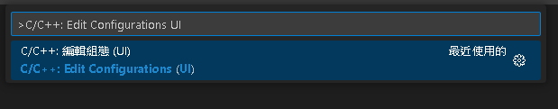

再來會跳出的視窗，這裡是C/C++編譯、語法的一些設定  
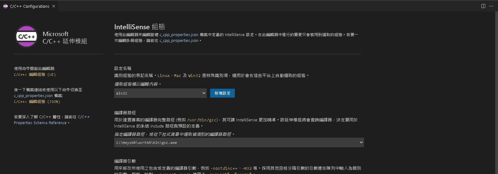

### 編譯器路徑

首先是編譯器路徑，右邊下拉選單應該會有不同種選擇  
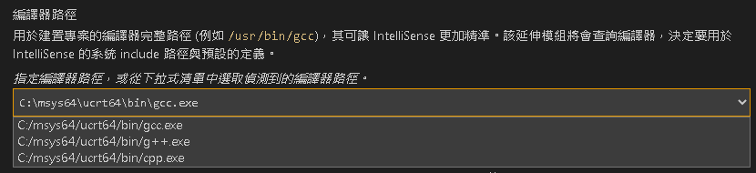

如果一個都沒看到，很大概率是你的系統路徑設定錯誤，可以回去檢視有沒有每項都做到  
傳送門🚪：[在Windows安裝C/C++ Compiler - 重點：加入系統路徑](/p/%e5%9c%a8windows%e5%ae%89%e8%a3%9dc/c-compiler/#%E9%87%8D%E9%BB%9E%E5%8A%A0%E5%85%A5%E7%B3%BB%E7%B5%B1%E8%B7%AF%E5%BE%91)

- 編譯C，選擇`gcc.exe`
- 編譯C++，選擇`g++.exe`

這裡講一下畫面中`gcc.exe`、`g++.ex`、`cpp.exe`的不同：

- gcc.exe：編譯C語言，處理.c結尾的檔案
- g++.exe：編譯C++語言，處理.cpp結尾的檔案
- cpp.exe：處理宏(macros)，擔任前置處理器(preprocessor)的角色

點選正確的編譯器之後，才不會出現一堆錯誤

### Intellisense 模式

- 甚麼是Intellisense(智能感知)？  
**簡單來說，就是讓你寫程式不用那麼累**

很多時候我們會用到來自其他函式庫的東西，這時候如果要去尋找這個函式該怎麼使用  
就要一層一層點點點，點到函式宣告的地方，才能真正知道  

有Intellisense之後，IDE就會自動幫我們去完成這件事  
或是在語法上提供一些指引，讓我們寫Code出錯機率不那麼高  

以下是一些Intellisense的實際作用：
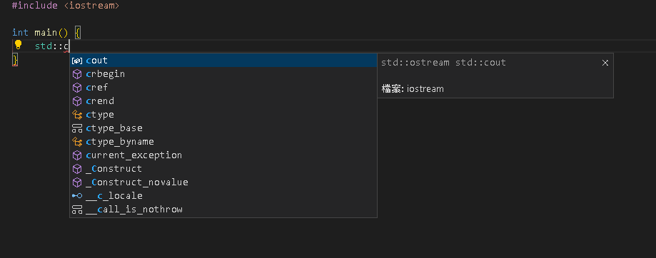  
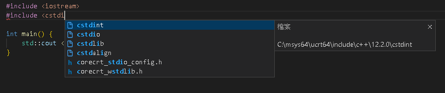  
||所以你們還不趕快拜Intellisense||

Intellisense的模式就很多樣化了  
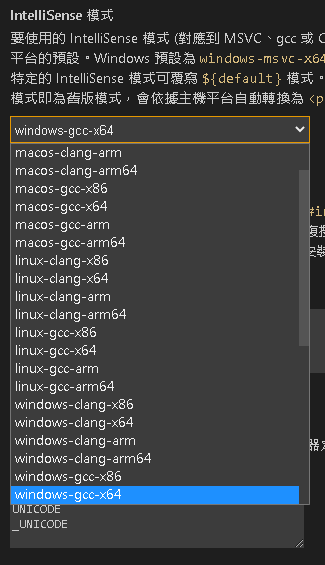  
可以使用下列填空題來找到該選哪個  

> [系統平台]-[編譯器版本]-[系統架構]

以我用Windows x64 Bit，安裝GCC舉例，就要選

> windows-gcc-x64

用MACOS Arm64，安裝CLANG，就要選

> macos-clang-arm64

後面的新手盡量不要去動，不然出錯了很難找到原因

## 編譯

都設定好後，回到程式碼檔案，按下`Ctrl+Shift+B`應該會出現  
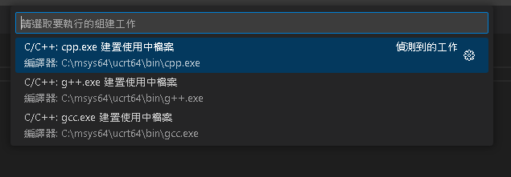

這時候不要著急點，你應該點的是旁邊的齒輪
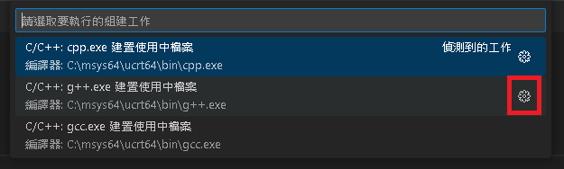

會多出一個名為`tasks.json`的檔案
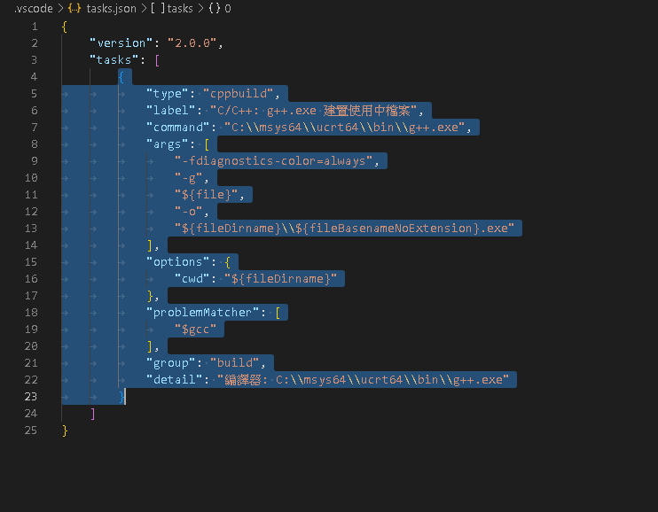

這時候再按一次`Ctrl+Shift+B`，就可以成功編譯
```
 *  正在執行的工作: C/C++: g++.exe 建置使用中檔案 

正在開始建置...
C:\msys64\ucrt64\bin\g++.exe -fdiagnostics-color=always -g C:\...\main.cpp -o C:\...\main.exe

已成功完成建置。
 *  工作將被重新啟用.按任意鍵關閉.
```

程式碼下方會多出一個跟檔案同名的exe檔，按`Ctrl+Shift+~`(ESC下方那顆)

我的cpp檔案叫`main.cpp`，編譯之後會有`main.exe`  
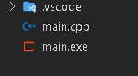  
在終端打上main.exe，**按下`TAB`**  
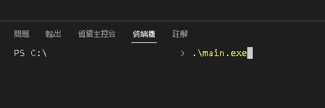  
按`ENTER`就能看到執行結果！

```
PS C:\...\test> .\main.exe
Hello world
PS C:\...\test> 
```
