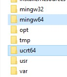
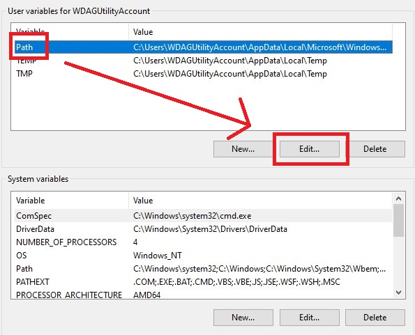
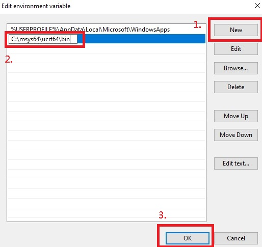

在學寫C++的時候，不想用Visual Studio(太肥)，只好拿VSCode來練練手  
這樣的話就要額外裝編譯器了  
想當時裝個MinGW，就不知道如何下手，研究過後寫篇文章幫幫他人

## MSYS2：微軟官方推薦安裝
官網：[MSYS2 - Getting Started](https://www.msys2.org/)

先下載安裝檔，下載位置官網點進去就有，很大很亮眼  


打開後一直點Next即可，當然途中想改安裝位置也沒問題


按Finish後會跳出一個終端機視窗，請注意紅框中的UCRT64


目前MSys2內的Mingw分七種版本：
<table>
    <tr>
        <td>名稱</td>
        <td>前綴</td>
        <td>工具鏈</td>
        <td>架構</td>
        <td>C 函式庫</td>
        <td>C++ 函式庫</td>
    </tr>
    <tr>
        <td>MSYS</td>
        <td>/usr</td>
        <td>gcc</td>
        <td>x86_64</td>
        <td>cygwin</td>
        <td>libstdc++</td>
    </tr>
    <tr>
        <td>UCRT64</td>
        <td>/ucrt64</td>
        <td>gcc</td>
        <td>x86_64</td>
        <td>ucrt</td>
        <td>libstdc++</td>
    </tr>
    <tr>
        <td>CLANG64</td>
        <td>/clang64</td>
        <td>llvm</td>
        <td>x86_64</td>
        <td>ucrt</td>
        <td>libc++</td>
    </tr>
    <tr>
        <td>CLANGARM64</td>
        <td>/clangarm64</td>
        <td>llvm</td>
        <td>aarch64</td>
        <td>ucrt</td>
        <td>libc++</td>
    </tr>
    <tr>
        <td>CLANG32</td>
        <td>/clang32</td>
        <td>llvm</td>
        <td>i686</td>
        <td>ucrt</td>
        <td>libc++</td>
    </tr>
    <tr>
        <td>MINGW64</td>
        <td>/mingw64</td>
        <td>gcc</td>
        <td>x86_64</td>
        <td>msvcrt</td>
        <td>libstdc++</td>
    </tr>
    <tr>
        <td>MINGW32</td>
        <td>/mingw64</td>
        <td>gcc</td>
        <td>i686</td>
        <td>msvcrt</td>
        <td>libstdc++</td>
    </tr>
</table>

而MSYS2本身，只能算是一個幫助你建置環境的工具

**那剛剛提到的UCRT又是甚麼?**

UCRT的全名是`Universal C Runtime`，被Microsoft Visual Studio採用  
主打更好的相容性，用起來跟MSVCRT一樣

MinGW則採用MSVCRT，`Microsoft Visual C++ Runtime`，看名字就知道跟微軟有關，可是聽MSYS2官網的介紹是缺點一堆阿...  
唯一的好處是只要你用Windows系統那就可以直接用，真不錯(?

原文連結：[Environments - MSYS2](https://www.msys2.org/docs/environments/)

### 我該安裝哪種?

**如果你是在Windows系統上做開發，UCRT64跟MINGW64都可以**  

但是我推薦UCRT

接下來我會分兩種教學

### 安裝教學

1. 注意你用的終端機版本

這是UCRT64的


這是MINGW64的


2. 在終端機中打上

UCRT
```
pacman -S mingw-w64-ucrt-x86_64-gcc
```

MINGW
```
pacman -S mingw-w64-x86_64-gcc
```

確認安裝
```
:: Proceed with installation? [Y/n]  <-- 這裡輸入Y(大寫)
```

等他載完即可，記得確認一下安裝是否正確
```
gcc --version
```
```
# gcc --version
gcc.exe (Rev10, Built by MSYS2：2023-02-19
Copyright (C) 2022 Free Software Foundation, Inc.
This is free software; see the source for copying conditions.  There is NO
warranty; not even for MERCHANTABILITY or FITNESS FOR A PARTICULAR PURPOSE.
```

3. 安裝工具包(可選)

UCRT
```
pacman -S mingw-w64-ucrt-x86_64-toolchain
```

MINGW
```
pacman -S mingw-w64-x86_64-toolchain
```

因為是包，所以會跟你確認有哪些要裝  
第一次安裝的大人請直接Enter略過，等之後有經驗了變成小孩再選擇
```
Enter a selection (default=all):  <-- Enter
```

跑完就ok了~

### 重點：加入系統路徑

首先要知道你的MSYS2裝在哪裡  
以剛剛安裝為例，應該是裝在`C:\msys64`下

然後去資料夾內依照你安裝的版本，尋找`\ucrt64`或`\mingw64`



以安裝`ucrt64`為例：  
裡面內有個名為bin的，請將此資料夾路徑複製下來  
```
C:\msys64\ucrt64\bin
```

然後按Win+R，輸入
```
rundll32 sysdm.cpl,EditEnvironmentVariables
```

找到Path後按編輯



進去之後按新增->貼上剛剛複製的路徑->確定



如果你以上步驟都正確，沒有出現錯誤  
那麼恭喜你，你可以開始學習C/C++之路了

編譯C
```
gcc main.c -o main.exe
```

編譯C++
```
g++ main.c -o main.exe
```

## MinGW Manager：坊間古早味

直接上Google搜尋`vscode 安裝c++`，大概會找到MinGW Manager  
它的優點：
- 簡單快速
- 視覺化安裝

缺點：
- 版本很舊

對比一下MSYS2跟MinGW Manager的最後更新時間 (截自文章發布)：  
- MinGW Manager： **2017-09-06**  
- MSYS2：2023-02-19

差太多了吧！本身很舊以外，**裡面的安裝包還是2013年的**  
所以不想被時代潮流汰換的話，還是安裝MSYS2會比較好

MinGW Manager載點：[MinGW - Minimalist GNU for Windows](https://sourceforge.net/projects/mingw/)

網路上教學很多，我只介紹一下  
米爾大大教學：[[VSCode] Visual Studio Code 執行 C++ (1) - 安裝 VSCode + MinGW](https://ithelp.ithome.com.tw/articles/10190235)
