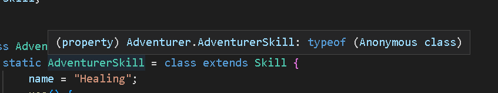
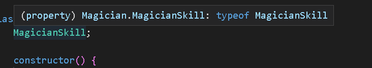

自從JS推出Class之後，我就覺得他好原始(x  
說真的，JS裡面的Class真的不成熟，很多東西都沒有  
甚麼public、private、override、virtual  
雖說TS都有，但有些情況下TS開發是災難  
寫起JS的物件導向會掉根頭髮

## 寫法

### 靜態
```js
class Skill {
    name;
    use() {}
}

class Character {
    skill = new Skill();
}

class Adventurer extends Character {
    static AdventurerSkill = class extends Skill {
        name = "Healing";
        use() {
            console.log("HP+100");
        }
    }
    skill = new Adventurer.AdventurerSkill();
}
```

### 動態
```js
class Magician extends Character {
    MagicianSkill;

    constructor() {
        this.MagicianSkill = class extends Skill {
            name = "Strengthening";
            use() {
                console.log("ATK+100");
            }
        }
        this.skill = new this.MagicianSkill();
    }
}
```


個人覺得這種寫法很酷，而且可以提高通用性，到時候只要統一呼叫
```js
character.skill.use();
```

有趣的是，當VSCode在推斷型別的時候：



