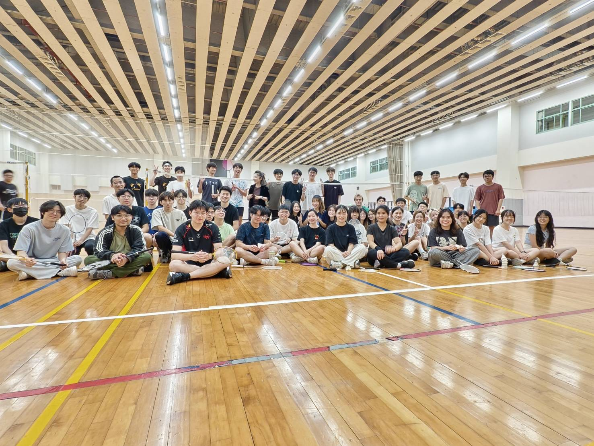

### 羽球初級
> [!IMPORTANT] 課程資訊
授課教授：李文心
實得等第：A+
甜度指數：⭐⭐⭐⭐⭐
涼度指數：⭐⭐⭐⭐⭐
Office Hour：事前預約

> [!NOTE] 分數組成
個人技巧測驗 40%
出席學習態度 30%
單雙打排名賽練習 30%


大推，老師人很好，上課就先說自己A+率過90，但她沒在怕，愛死。

加簽條件老師會先問你有沒有基礎，以及你有沒有帶球拍跟球(我忘記了跟別人借球，真的很謝謝他)，如果有參加過系羽會優先選上，若有基礎建議直接衝。

簽到是紙本簽到，每堂課開頭會有個表格給你打勾，如果晚到可以找助教補簽，老師基本上不太在意、好像也抓不太到遲到這件事，所以晚個幾十分鐘應該無所謂，不過免費的球場有不打的理由嗎？

考試有考低手發球、高遠、Z字步這三個，還有單雙打的比賽。老師說他會用初學者的角度平等審視所有人，基本上動作對了氣勢有了，再加上有界內，就會給高分。不過我發球、高遠不是出界就是掛網，但還是拿到很高的分數，愛了。

在期中考、期末考周，老師會自主放假一周，即當周不上課，但你想打球仍然可以到上課地點打，愛死，免費的球場有不打的理由嗎？除了上課，其他認真的羽球問題也可以問老師，他會很認真的示範動作以及回答你訓練方法，助教是校隊的也很熱心，上課都會下去問每個人有沒有問題。

排名比賽老師說志在參加，排名之間的分數差距不會很大。一開始老師會教你根據自己的實力分組，我都挑比自己實力弱的組別參加炸魚，課上有個外國人一直很賭爛我為甚麼在它們組，我說我想要 easy life，最後就是拿單雙打的分組第一。

課堂上也有那種真強者在打球，我高遠都被他們拉爆嗚嗚，他們到底來初級幹嘛的。課程整體氣氛偏開朗，最後老師會有個大合照環節，挺好笑的。


總而言之就是李文心一生推。

---

### 英文二
> [!IMPORTANT] 課程資訊
> 授課教授：柏毅嘉 Guy Beauregard
> 實得等第：A
> 甜度指數：⭐⭐
> 涼度指數：⭐
> Office Hour：事前預約

> [!NOTE] 分數組成
> Attendance and participation 10%
> Quizzes 20%
> Writing exercises 30%
> Group presentation 40%

#### **加簽難易度**
不知道，我是因為上學期的英文一直接獲得英文二，還自動換了老師。

#### **出席要求、請假機制**
每堂課開始老師會拿著你學期初寫的自我介紹小卡片點名，只要老師手上還拿著你的卡片就不算遲到，如果有忘記拿東西可以先跟他說再跑走。

關於請假，不論你發生了甚麼事，都一定要寫信讓他知道你要請假，不然缺席會扣很多分。

#### **老師、助教如何**
老師是外國人，不過沒什麼口音，主要使用英文，中文通常只會說好不好三個字。人很和善，下課會到處走動隨機抓人聊天，他會很認真記住每個人的名字。
他自己不喜歡用麥克風，導致他常常覺得電風扇很吵要關起來，同時他也不喜歡有人上課在用手機平板，被他注意太多次會被警告。另外，他很討厭使用 NTU COOL，請做好 COOL 上**沒有任何東西**就獲得等第的準備。手寫的字特別抽象，但板書就沒問題，超級怪，手寫字建議搭配助教或教授閱讀，雖然他自己有時也看不懂。
有趣的是，我感覺教授比我這個台灣人還要了解台灣，許多我們在課本上看過的歷史事件(如228)他都很了解，還跟我說嘉義其實是全台灣平地最冷的地方，驚呆了。
有任何問題我都建議直接跟教授說，他不太在意你問的問題是不是他講過了或者怎樣怎樣的。他喜歡別人直接叫他Guy，因為他說在國外的文化中，通常是叫老師 Teacher + Surname ，但台灣一堆學生都會叫他 Teacher Guy。

助教蘇媺(ㄇㄟˇ)人真的很 easy going，有任何問題基本上比較站在學生那邊，寫信也是都秒回，也很常跟我們抱怨教授怎樣怎樣，我還記得她跟修過英文一的學生聚在一起臭英文一的教授，真的很好笑。
但她感覺很累(?)，因為我們的Writing Exercise、報告都一定要跟她討論過才能給教授看，而且她還有同時修教授的另一門課，是被教授認證的過勞，不時還會獲得教授的道歉。


#### **課程內容、教材**

> [!SPOILER] Schedule
> ```
> Part One: Skills
> 
>     Week 1 (February 26): Introduction to course objectives; writing exercise #1
> 
>     Week 2 (March 5): What is academic writing?
> 
>         Reading: Jane E. Aaron handout: “Features of Academic Writing” (pages 3-9)
> 
>     Week 3 (March 12): Integrating sources; Quiz #1
> 
>         Reading: Jane E. Aaron handout: “Integrating Sources” (pages 133-141)
> 
>     Week 4 (March 19): Documenting sources; Quiz #2
> 
>         Reading: Pearson Guide to the 2021 MLA Handbook handout (pages 8-9 and pages 37-41; you can also consult the sample Works Cited list if you wish on pages 47-53); plus details about the course package
> 
> Part Two: Texts
> 
>     Week 5 (March 26):
> 
>         Reading: “The Address of Personally Attending the Opening of the 228 Monument”; “The 228 Monument Inscription”; plus presentation guidelines and topics
> 
>     Week 6 (April 2): Review; plus presentation sign-up
> 
>     Week 7 (April 9):
> 
>         Reading: “We Are Homosexuals, We Love You!”; “Gay Rights Activists Attack Obscenity Law”
> 
>     Week 8 (April 16):
> 
>         Reading: “Film Addresses Taiwan’s Lack of Respect for Animals”; plus screening of Pick of the Litter (film)
> 
>     Week 9 (April 23): Writing exercise #2 due at beginning of class
> 
>         Reading: “Toward a Nuclear-free Homeland”; plus screening of Voices of Orchid Island (film)
> 
>     Week 10 (April 30):
> 
>         Reading: “Shelter from the Storm”; plus screening of Surviving Morakot (film)
> 
>     Week 11 (May 7):
> 
>         Reading: “The Green ‘Preacher’”; plus screening of The Age of Awakening (film)
> 
>     Week 12 (May 14): Review; writing exercise #3 due at beginning of class
> 
> Part Three: Presentations
> 
>     Week 13 (May 21): Group presentations
> 
>     Week 14 (May 28): Group presentations
> 
>     Week 15 (June 4): Group presentations
> 
>     Week 16 (June 11): Wrap-up and review
> ```


前四周有關 Jane E. Aaron 的教材老師會印好給你，後面 W5~W12 會需要你去影印店自行購買，已經印好了去付錢就行。可以看出教學內容跟台灣人比較有關係，主題很廣闊也很開放，有種開始關懷這片土地的感覺，至少我很喜歡這樣，~~已經比英文一好太多了~~。

#### **作業、學習時數**
接近報告的時候才會花一堆時間(約6+小時)，平時每周只要大約花十分鐘把當周的文章看過、劃過筆記就可以了。小考前只要認真把教材讀過一遍就好。

此外還會有三次的 Writing Exercise，沒有題目限制，不過會希望你以**一篇、課內的文章**為主題，寫出你自己對於這篇文章的詮釋與心得，重點是要展現出你在前四周學到的 Academic Writing、Text Reference 的知識還有你個人的解讀。但我想說，你教材都給報刊雜誌是要有甚麼個人解讀，很解好嗎...。

#### **考試、報告**
沒有期中期末，~~但老師期中期末周會問你還活著嗎~~。前四周有兩次小考，考十題、全選、每題一分，不過基本都很水，第一次小考老師因為其中一題太多人錯就全班加一分，我在兩次小考獲得了19/20的好成績，你也來試試吧。

報告就是標準的大型報告，會需要你花至少兩周的時間在準備，大家都很卷。老師會提供6個題目，每個題目會有不同的報告日期，試試看在前幾周觀察出會帶飛你的組員吧。

> [!SPOILER] 報告題目
May 21: What do we need to know about 228 Peace Park / 228 Monument(s) / the 228 Memorial Museum(s) in Taipei?
May 21: What do we need to know about LGBTQ+ rights / Pride Parade(s) in Taiwan?
May 28: What do we need to know about animal rights in Taiwan?
May 28: What do we need to know about the rights of Indigenous peoples and/or the topic of nuclear waste in Taiwan?
June 4: What do we need to know about Typhoon Morakot and its aftermath in Taiwan?
June 4: What do we need to know about environmental activism in Lukang and/or elsewhere in Taiwan and/or around Asia?

> [!SPOILER] 報告須知
> FE II - GUIDELINES FOR GROUP PRESENTATIONS
> **Overview:**
> 
> The group presentations will be your final project for this course. They are a chance for you to apply the skills you have learned about academic writing, including integrating sources and > documenting sources; they are also a chance to do some research to find new sources and thereby extend your understanding of the topics that we will discuss in the section on “Texts.”
> 
> Your group presentations will be scheduled on **May 21, May 28, and June 4** depending on your presentation topic. As you prepare, please follow the guidelines listed below.
> **Guidelines:**
> 
> 1. **For this exercise, please work in groups of five.** Based on our current enrollment numbers, one group will have four members.
> 2. **Ask yourselves: what do your classmates need to know about the topic?** Try to find, integrate, and present the following information and reflections as clearly as you can:
> * A short explanation of the topic (example: what is the 228 Incident?)
> * If applicable, some historical grounding (example: when did Typhoon Morakot hit Taiwan?)
> * Some reflections on why this topic could—or should—be important to us (example: why should we care about environmental activism in Taiwan or around Asia?)
> 
> 
> 3. **Prepare a one-page handout (single-sided or double-sided).** This handout should include your full names and student numbers, the topic of your presentation, and an outline of your major points. There are 29 students plus one professor and one TA in our class, so when you prepare copies please plan accordingly. In addition, you are also welcome to present extra materials (including visual materials and/or sound files) if you think they are helpful. In the past, students have found it helpful to use powerpoint or similar software to integrate these additional materials into their presentations.
> 4. **Practice your presentation.** Try to make your presentation at least 20 minutes and no more than 30 minutes long. Do your best to follow the suggestions provided by the TA Leah. Make sure everyone has a chance to speak. Be prepared to answer questions based on the materials you’ve presented.
> 5. **Regarding use of generative AI platforms**: Each group must submit a short statement, written in English or in Chinese and printed and signed by all group members, indicating whether > generative AI platforms were used at any time in preparing for this presentation. If the answer is "no," please write: "No gener ative AI platforms were used in preparing for this > presentatiion." If the answer is "yes," please provide a precise description of which platform was used, how it was used, and for what exact purposes. This signed statement must be submitted > to the instructor or to the TA before the presentation begins. As you prepare; please remember a basic point we learned about documenting sources: academic work requires you to properly credit all sources you consult, summarize, paraphrase, or quote as you prepare your work. Giving credit to others is an important part of being successfu at a research university ssuch as NTU--and we want you to be successful! Please note however that failure to provide this signed statement or failure to properly credit sources could llead to a failing grade for this assignment and/or for this course.
> 6. **Have fun!** I hope this exercise provides you with a chance to get to know some of your classmates, to be creative, to learn new things, to properly credit your sources, and to practice using university-level English. Good luck!

#### **考古題**

找不到，或許你可以找看看這個網頁...？
<span style="color: transparent;">Go find /FE2_Quiz1.txt and /FE2_Quiz2.txt</span>

#### **其他**

很累但也確實學到不少東西，我的台灣價值又提升了哈哈哈。

---
### 微積分3 / 微積分4
> [!IMPORTANT] 課程資訊
> 授課教授：蔡國榮
> 實得等第：B+/A+
> 甜度指數：★
> 涼度指數：★
> Office Hour：Monday 10(17:30\~18:20) | Wednesday 6,7(13:20\~15:10) | Friday 6,7(13:20~15:10)

> [!NOTE] 分數組成
> Quizzes 20%
> Assessment 30% (Capped at 30%)
> Final Exam 50%

#### **加簽難易度**
不知道，直接選就上了 😋。

#### **出席要求、請假機制**

最好給我去喔，國榮的課還不上是怎樣？？

#### **老師、助教如何**

國榮的偉大毋需多言。

#### **課程內容、教材**

Calculus 3
1. Introduction to Curves and Surfaces
2. Partial Derivatives
3. Chain Rule and Directional Derivatives
4. Optimizations in Multivariables
5. Multiple Integrations 

Calculus 4
1. Line integrals
2. Green’s Theorem and Conservative vector fields
3. Surface integrals and Flux
4. Stokes’ and Divergence Theorem
5. Series : definition and convergence tests
6. Power series : radius of convergence and their calculus
7. Taylor's theorem and its applications

自製教材，國榮的偉大毋需多言。

#### **作業、學習時數**

每周會有一份作業，難度中等偏上，通常要花 2~3 小時寫，小考前我還會花約3小時刷考古，期考會花8+小時刷考古。所以每周大概是 3+ 小時的學習時間。

國榮的偉大毋需多言。

#### **考試、報告**

只有兩次小考與最後的期考，微三期考真的很難... 😥。但微四好像老師放水了，所以我拿了 A+，不然根據國榮所述，大概有 20~30% 的學生在微四會被當掉。

國榮的偉大毋需多言。

#### **考古題**

[微積分統一教學網 - 歷屆考古題](https://www.math.ntu.edu.tw/~calc/cl_n_34455.html)

#### **其他**

翹棍請放過我。
國榮一生推，國榮的偉大毋需多言。

---
### 普通物理學甲下
> [!IMPORTANT] 課程資訊
> 授課教授：楊佩芸
> 實得等第：A+
> 甜度指數：★
> 涼度指數：★
> Office Hour：事前預約

> [!NOTE] 分數組成
> 作業 35% 	
> 小組討論：出席 7% + 同儕互評 3%
> 期中+期末 55%
> 期末評鑑 1%(?)

#### **加簽難易度**

基本上有簽就上。

#### **出席要求、請假機制**

每堂課會有不固定數量的 Zuvio Pop Quiz 當作點名。請假不需經過老師同意也不用真的去系統請假，但是需要在下一堂課課間去找老師回答缺課那堂的 Zuvio 問題來拿回失去的出席分數。

#### **老師、助教如何**

老師人真的很好了，但考試出的題目是真的不好，期中平均 59.99、期末 78 。助教給到ㄆ級分，基本上只有助教課及要分環節會出現在你的視野裡，改考卷的速度真的很慢，考試後兩周成績還沒出。但是要分只要合理都會給，以及給分挺寬鬆的。

#### **課程內容、教材**

> [!SPOILER] Schedule
> ```
> 第1週 	2/25 	        Introduction; Electric Charge and Electric Field
> 第2週 	3/4, 3/6 	Gauss’s Law
> 第3週 	3/11, 3/13 	Electric Potential
> 第4週 	3/18, 3/20 	Capacitance and Dielectrics
> 第5週 	3/25, 3/27 	Current, Resistance, and Electromotive Force
> 第6週 	4/1 	        Direct-Current Circuits
> 第7週 	4/8, 4/10 	Magnetic Field and Magnetic Forces
> 第8週 	4/15, 4/17 	Sources of Magnetic Field; 4/17 Midterm
> 第9週 	4/22, 4/24 	Electromagnetic Induction
> 第10週 	4/29 	        Inductance
> 第11週 	5/6, 5/8 	Alternating Current
> 第12週 	5/13, 5/15 	Electromagnetic Waves
> 第13週 	5/20, 5/22 	The Nature and Propagation of Light
> 第14週 	5/27, 5/29 	Interference/ Diffraction
> 第15週 	6/3, 6/5 	Special Relativity
> 第16週 	6/10, 6/12 	Brief Introduction to Quantum Computation; 6/12 Final
> ```

老師自己手寫教材，會放在 COOL 上，很感動這個 AI 時代還有願意手搓的老師😭😭，老師的字好好看，另外會有每周的錄影放在 COOL 上。

#### **作業、學習時數**

作業約是兩周一次的量，每次約4~6題，不過每題都@#&%!難寫，通常會花 3 個多小時在寫作業，題目很需要創意思考以及活用課堂上的知識。此外，有關分組，是在開學找好組，然後每次作業會需要你們組聚在一起討論作業內容，雖然一堆人聚在一起討論了，但題目難度還是會讓大家意見不一致😥。

#### **考試、報告**

只有期中期末。題外話，期中佩芸出了一份題目超級多的考卷，導致大部分人是(包含我)既寫不完又看不懂題目，期末佩芸說會收斂，也確實把大刀收起來了，愛佩芸 😍。

#### **考古題**

老師反對考古，所以只能靠學長姐家傳...想要的來找我拿吧...。

#### **其他**

B-以上的等第線都會往上拉，想要拿A+需要95分。還有老師會唱歌... @sheepsfairygarden。

---
### 數學沙龍與生涯探索
> [!IMPORTANT] 課程資訊
> 授課教授：合授
> 實得等第：Pass
> 甜度指數：★★★★★
> 涼度指數：★★★★★
> Office Hour：無

> [!NOTE] 分數組成
> 無

#### **加簽難易度**

不知道

#### **出席要求、請假機制**

每次演講會有點名表，也不知道沒點到會怎樣。

#### **老師、助教如何**

每位講者做的研究、人生經歷都很有趣，雖然我好像沒什麼學到。

#### **課程內容、教材**

演講 PPT

#### **作業、學習時數**

學期末會有一個作業需要你寫，內容是最有收穫的演講以及你個人的履歷。

#### **考試、報告**

無

#### **考古題**

無

#### **其他**

每次都有東西吃，愛講座。

---
### 毒道之處∼看不見的危機!
> [!IMPORTANT] 課程資訊
> 授課教授：合授
> 實得等第：A
> 甜度指數：★★★
> 涼度指數：★★★★
> Office Hour：無

> [!NOTE] 分數組成
出席率 15%
課程參與 25%
期末報告 40%
期末影片 20%

#### **加簽難易度**

很難簽，不過我初選選上還被抽到加簽？

#### **出席要求、請假機制**

每次上課會有 Zuvio 點名。

#### **老師、助教如何**

沒什麼互動不知道。但有些老師講話很像在話家常，特別催眠。

#### **課程內容、教材**

> [!SPOILER] Schedule
> ```
> 第1週 	2/23 	課程簡介/後毒物時代的恐慌
> 第2週 	3/2 	你喝的水安全嗎? - 眼不見為淨？
> 第3週 	3/9 	吐司片上的萬花叢 - 淺談黴菌毒素與食物污染 
> 第4週 	3/16 	卡路里毒性效應-燃燒脂肪之後
> 第5週 	3/23 	有機不有機 – 土壤 生態 與農藥
> 第6週 	3/30 	細胞不死，不死細胞-談環境因子與惡性腫瘤 是吃藥還是服毒 - 藥物副作用
> 第7週 	4/6 	民俗掃墓節遇例假日補假
> 第8週 	4/13 	期中考週
> 第9週 	4/20 	無法呼吸的空氣(PM2.5,奈米粒子,環境荷爾蒙，重金屬)
> 第10週 	4/27 	美麗的真相 - 化妝品與保養品 
> 第11週 	5/4 	毒品 - 毒品開趴，濫用之後
> 第12週 	5/11 	為什麼加工食品的成分好複雜 ? 食品添加物是必要之害 ?
> 第13週 	5/18 	有機溶媒 - 溶化污垢，融化健康！
> 第14週 	5/25 	是吃藥還是服毒 - 藥物副作用
> 第15週 	6/1 	人如其食-環境, 飲食與基因調控 
> 第16週 	6/8 	期末考週
> ```

每次講者自備 PPT 還有課程錄影上傳到 COOL，小心有些講者的 PPT 裡面只有圖片。

#### **作業、學習時數**

課前會有 Zuvio 題目，同時課中會不定時出現一些題目要寫，最後上完課會有課後回饋。

#### **考試、報告**

期末報告分成個人和團體報告兩種，分組是期初隨機分配，所以不存在找組員這件事。

先說個人報告，需要你針對其中一個上課主題做研究，課程會提供以前學長姐的範本，所以不是特別難。

團體報告則需要組別針對其中一個上課主題製作一個影片，這點就很吃組員了...。

#### **考古題**

無

---
### 資料結構與演算法
> [!IMPORTANT] 課程資訊
授課教授：林軒田/蔡欣穆
實得等第：A
甜度指數：★
涼度指數：★
Office Hour：課後/事前預約

> [!NOTE] 分數組成
程式 20%
手寫 10%
活動 10%
期中 30%
期末 30%

#### **加簽難易度**

一類沒啥好說的。

#### **出席要求、請假機制**

無。

#### **老師、助教如何**

先說林軒田~~教授~~學長，我很喜歡他在課堂最後都會有個 fireside chat ，聊聊他對資訊系學生的問題，還有分享自己的個人經驗。上課方式也很輕鬆幽默，但是他會一直臭所有政治人物 🤣，每次上課都在開地圖炮。

蔡欣穆教授上課一樣蠻有趣的，而且他的直播設備很齊全，甚至還有即時翻譯英文，不愧是 NASA 老師。我很喜歡他特意在教材裡面塞空間讓我們可以做筆記，不過教授本身的筆記是有點過於難懂了...。

助教團隊由 22 位助教組成，會開一個 DSA 專屬 DC 群，可以在裡面自由發問，只要 tag 就是秒回，所以不論手寫還是程式題都可以及時得到各種回饋和幫助。要分方面，一樣是有理一定給，我自己覺得助教不太會亂改或改錯，就是跟助教吵一吵會發現自己錯的那種。
#### **課程內容、教材**

> [!SPOILER] Schedule
> W1 Introduction, Algorithm
> W2 Data Structure, Analysis Tools 
> W3 More Analysis Tools, Linked List 
> W4 Stack, Queue
> W5 Tree, Binary Tree
> W6 Heap, Binary Search Tree
> W7 Comparison Sort
> W8 Midterm
> W9 String Matching
> W10 Graph, BFS, DFS
> W11 Disjoint Union
> W12 RB-Tree
> W13 B-Tree
> W14 Hashing
> W15 Linear Sorting
> W16 Final

除了 PPT 還有課程錄影會上傳到 COOL ，此外也有過往課程的錄影。指定用書就是鼎鼎大名的 CLRS ，真的很難啃。後來我都是看印度人的影片才把紅黑樹、BTree、Dynamic Hash Table那些搞懂。
#### **作業、學習時數**
~~萬惡痛苦循環~~

每兩周會有一份大作業，作業分為手寫和程式兩部分，各兩大題。手寫通常會分為很多子題，其中就是要寫數學證明、 寫pseudo code 、為甚麼你的 code 是對的、為甚麼你的 code 符合題目的複雜度...等等，非常需要動腦，有好幾題我想不出來都跑去問 Gemini 。

程式題則需要你活用上課的知識，搭配許多通靈才能寫出來，不過越往後教資料結構越複雜，題目反而偏向裸題，但是手刻那些資料結構 ~~紅黑樹~~ 真的會累死人。

此外還有 HW0 、 Mini-Homework 和 Inclass-Homework。HW0 是要讓你測試自己有沒有足夠的程式能力可以修這門課， Mini-Homework 則偏向寫大作業前的程式練習，先讓你複習上課教的資料結構，Inclass-Homework 則是在後半學期才會出現，都是讓你上課練習的簡單題目。

個人體感難度：手寫 >= 程式 > Mini-HW > HW0 > Inclass-HW
#### **考試、報告、活動**
有期中期末，都頗難，每年的題目都會更新，可以帶不定張數的大抄，強烈建議把作業、考古的解答印出來帶進去。
#### **考古題**
我們這屆有提供 2024 與 2025 這兩年考古，再加上我莫名其妙獲得 2023 年的考古，基本上已經寫不完了。所以可以跟助教要要看，應該官方會統一給。
#### **其他**
套用一句軒田學長說的話：

> 給資訊系的同學們：努力加油
> 給想加選的同學們：審慎考慮

這門課確實很硬，每周都要花約 20 小時在寫作業，作業是真他媽難寫，考試也是真他媽難寫，東西也是真他媽難懂，不過習慣了好像也還好，就只是循環而已。
對我來說，由於我之前已經學過比較基礎的資料結構還有演算法，概念並不是特別難懂。而新學的東西像是~~萬惡的~~紅黑樹等，也沒說到特別難。
我認為這門課的難點在於考試會需要你去活用資料結構，辨識出這題的 pattern ，然後想辦法把程式塞進題目給的時間複雜度內。因此，有策略的考試(如先找簡單或會寫的題目)，還有審題(如從時間複雜度通靈解法)對想要拿高分是很重要的。
最後就是看著那些強者在天上飛阿...數學 big O 證明我都寫不出來 😭😭😭。

---
### 比特幣與數據分析
> [!IMPORTANT] 課程資訊
> 授課教授：廖世偉
> 實得等第：A+
> 甜度指數：★★★★★
> 涼度指數：★★★★
> Office Hour：無

> [!NOTE] 分數組成
> 作業 40%
> 期中 20%
> 期末 20%
> Final Project 20%

#### **加簽難易度**

不知道，初選選上的。
#### **出席要求、請假機制**

無。
#### **老師、助教如何**

跨領域、玩真的、做中學、躺著賺，小步快跑、快速迭代、與時俱進。
#### **課程內容、教材**

> [!SPOILER] Schedule
> ```
> 1. We'll teach you how to find edge. Without edge, there is no arbitrage. Once you master the arbitrage, you need to agentize the process. The overarching theme of this course is the 3A above: Advantage --> Arbitrage --> Agent. 
> 2. We'll teach you data-driven decision and quants. 
> 3. We'll focus on the Web3 example. We'll introduce students to the world of Decentralized Finance (DeFi) and explore the evolving blockchain landscape: 
> 3A. Blockchain Basics
> 3B. Smart Contract Programming
> 3C. Smart Contract Security
> 3D. Common ERC Standards and EIPs
> 3E. Overview of Decentralized Finance (DeFi)
> 3F. Advances and Innovations in DeFi
> ```

會上傳課程錄影、PPT到 COOL 上。
#### **作業、學習時數**

有分小 project 與寫題目，都不難。

#### **考試、報告**

🤫

#### **考古題**

想要的來跟我拿。
#### 其他

我認為這門課認真聽是能聽到很多課本上不會教的經驗，但可惜我連知識都沒有，所以聽不懂。

### 總而言之

修了 20 學分，最後 GPA 4.07 ，有達到我在學期初說要上 4 開頭的夢嗚嗚，系排名 22 (17.46%)。

