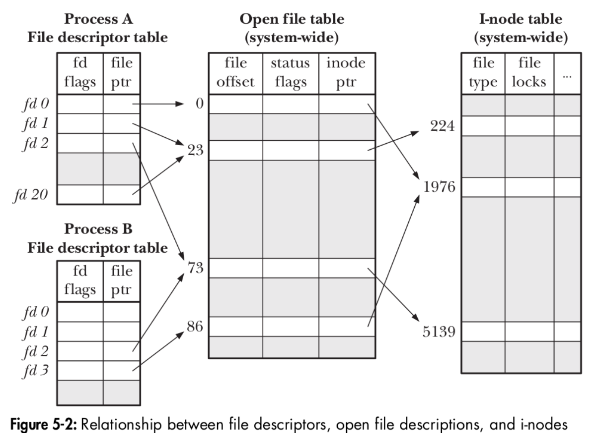

## 什麼是檔案？

在 Unix 系統中，有「everything is a file」的概念，如硬體設備、進程資訊、網路連線、處理器狀態等都抽象化為檔案系統中的一個路徑。透過這種設計，使用者只需要使用一套統一的 API（例如 `open()`, `read()`, `write()`, `close()`），就能操作各種截然不同的系統資源，而不需要為每一種硬體另外撰寫專屬的操作介面。比方說 `/proc/cpuinfo` 這個路徑包含了 CPU 資訊， `/dev/sda` 則代表整顆實體硬碟。

一個檔案通常用一個路徑表示，在程式內則用一個指標（或者稱作 File Descriptor, FD）指著。在作業系統中，一個檔案可能會有很多不同指標指著。當程式開啟一個檔案時， Kernel 會維護三種結構：File Descriptor Table、System-Wide Open File Table、V-node Table（或 I-node Table）。

1. File Descriptor Table：
   每個 Process 都有自己獨立的 FD Table，FD Table 實際上只是一個陣列，每個 FD 是一個非零整數用來存取 FD Table。預設情況下，會開啟三個 FD，分別是 `stdin`、`stdout`、`stderr`，由 0、1、2 表示。再往後開啟的檔案，都由 3 往上加。
2. System-wide Open File Table：
   當呼叫 `open(2)` 時，Kernel 會建立一個 File Description 結構，這個結構儲存了本次開啟的操作狀態，包含讀寫的 Offset、開啟模式（如唯讀）、Reference Count（有多少個 FD 指向這個 File Description） 等等。
3. V-node Table：
   這裡面存的資料代表實體或靜態檔案資源本身，紀錄檔案的 Metadata，包含檔案大小、檔案類型、存取權限、所有者、指向實體磁區的指標等等。

> [!NOTE] 複製/繼承FD
> `dup(2)` 是複製一個已有的 FD 到目前最小可用的 FD 數字去。當使用 `dup(2)`，原本的 FD 與新的 FD 便都指向 Open File Table 中的同一個 File Description，兩者的檔案操作也會互相同步。
> `fork(2)` 作用是創造一個目前進程的子進程。子進程會繼承父進程的 FD ，所以兩者會有指向同一個 File Description，但是不同的 FD。下圖的 Process A 與 Process B 就有可能是父子進程。

下圖展示了上面三個數據結構的關係：


###  Source Code Trace

[/include/linux/sched.h](https://github.com/torvalds/linux/blob/master/include/linux/sched.h#L835)
```c
struct task_struct {
    ...
    struct files_struct *files;
    ...
};
```

`task_struct` 就是 Process Control Block ，包含該進程的各種資訊。其中的欄位 `files` 指向下面的結構，這就是每個 Process 的 File Descriptior Table：

[/include/linux/fdtable.h](https://github.com/torvalds/linux/blob/master/include/linux/fdtable.h#L26)
```c
struct files_struct {
    ...
    struct fdtable __rcu *fdt;
    struct fdtable fdtab;
    struct file __rcu *fd_array[NR_OPEN_DEFAULT];
    ...
};
```

[/include/linux/fdtable.h](https://github.com/torvalds/linux/blob/master/include/linux/fdtable.h#L26)
```c
struct fdtable {
    ...
    struct file __rcu **fd;
    ...
};
```

初始狀態下， `files_struct.fdt` 指向 `files_struct.fdtab` ，而 `files_struct.fdtab.fd` 又指向 `files_struct.fd_array` 。這樣實作的好處是，大部分進程開啟的檔案數量都很少（<64），所以先以靜態分配出 `NR_OPEN_DEFAULT` 大小，讓 `fdtab.fd` 指向 `fd_array` ，後續擴展再更換 `files_struct.fdt` 所指向的位置，存取時只需要統一讀取 `files_struct.fdt.fd` ，此外還能供多執行緒在無鎖狀態下讀取。

下面的 `struct file` 是存在 Open File Table 中的結構：
```c
struct file {
    ...
    struct inode *f_inode;
    ...
}
```
[/include/linux/fs.h](https://github.com/torvalds/linux/blob/master/include/linux/fs.h#L1255)

而 `struct file` 結構內則有 `f_inode` 指向該檔案的 metadata。實際上， linux 中沒有所謂的 System-wide Open File Table 這個"結構"，他是靠 Mempool 來分配 `struct file` 實際上的空間，以及利用 `f_ref` 追蹤有多少指標指向這塊記憶體，再加上 `fdtable` 來達成 $O(1)$ 存取 `struct file`。

> [!NOTE] 結構儲存位置
> 進程的虛擬記憶體，被分為三大塊：Kernel Space 下共用的記憶體、禁止存取區（Canonical Hole）、User Space 下的記憶體。而 User Space 下只會知道 `files_struct.fdt.fd` 中的陣列索引值，即先前提到的非負整數；在 Kernel Space 下則存著 `task_struct` 、 `fdtable` 、 `file` 等結構，防止有人惡意篡改導致內核大爆炸。也就是說，這些結構是每個進程都會有一個，但是存在 Kernel Space 中，且由 Kernel 維護。

### V-node vs. I-node

V-node （Virutal Node）由 Sun Microsystems 為 Solaris / BSD 系統開發，主要由 Unix 系統使用。早期的 UNIX 只支援本地傳統檔案系統（UFS），可以直接使用實體磁碟的 I-node。但後來為了支援網路檔案系統（NFS）以及其他非 UNIX 檔案系統，核心需要一個「抽象介面」來代表「任何檔案物件」。這個抽象介面就被稱為 V-node。

I-node（Index Node） 則是由 Linux 開發，包含儲存檔案的 Metadata，例如：檔案大小、權限、修改時間、存取控制，以及指向該檔案操作 API 的指標。不同於 V-node 的是，Linux 把「由路徑尋找檔案」的功能從 V-node 拆出來設計成 Dentry，而 Dentry 結構再指向 I-node，也就是說 I-node 只儲存檔案的 Metadata，V-node 則還保留著檔案路徑功能。

而 V-node 從路徑轉成檔案指標（以 `/usr/bin/bash` 為例），需要先找到 `/` 的 V-node ，往下找 `/bin` 的 V-node，再往下找到 `/usr/bin/bash` ；而 I-node 要從路徑找，靠的是 Dentry 中的 Hash Table 來快速找到 I-node，相較之下， V-node 結構本身比較冗餘且搜尋速度慢，這也是為什麼 Linux 可以輕鬆創造硬連結，只要將 Dentry 中的不同路徑指向同一個 I-node 就好。

## 什麼是 IO？

- Unbuffered I/O： syscall everytime
- Buffered I/O：no syscall everytime, buffered by c library