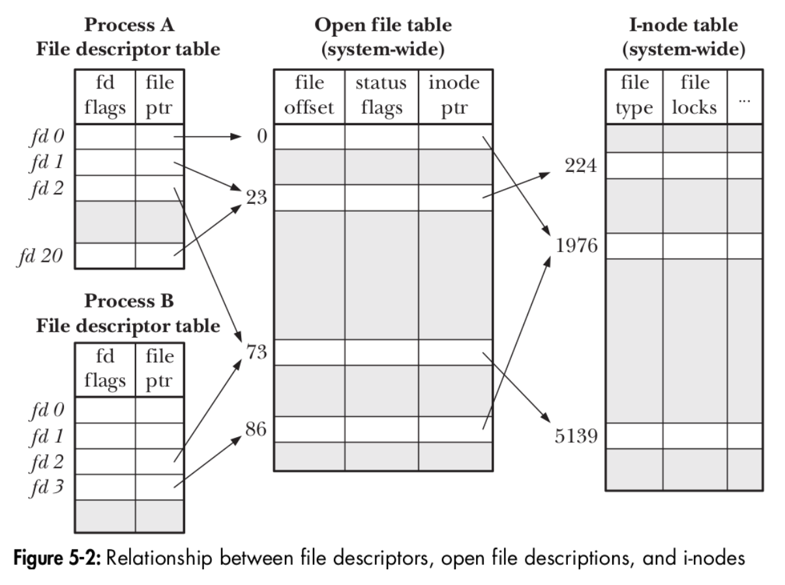
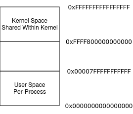
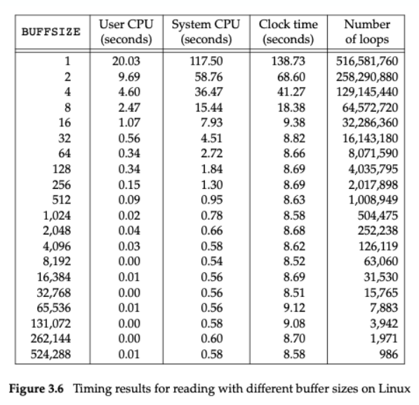

## 什麼是檔案？

在 Unix 系統中，有「everything is a file」的概念，如硬體設備、進程資訊、網路連線、處理器狀態等都抽象化為檔案系統中的一個路徑。透過這種設計，使用者只需要使用一套統一的 API（例如 `open()`, `read()`, `write()`, `close()`），就能操作各種截然不同的系統資源，而不需要為每一種硬體另外撰寫專屬的操作介面。比方說 `/proc/cpuinfo` 這個路徑包含了 CPU 資訊， `/dev/sda` 則代表整顆實體硬碟。

一個檔案通常用一個路徑表示，在程式內則用一個指標（或者稱作 File Descriptor, FD）指著。在作業系統中，一個檔案可能會有很多不同指標指著。當程式開啟一個檔案時， Kernel 會維護三種結構：File Descriptor Table、System-Wide Open File Table、Vnode Table（或 Inode Table）。

1. File Descriptor Table：
   每個 Process 都有自己獨立的 FD Table，FD Table 實際上只是一個陣列，每個 FD 是一個非零整數用來存取 FD Table。預設情況下，會開啟三個 FD，分別是 `stdin`、`stdout`、`stderr`，由 0、1、2 表示。再往後開啟的檔案，都由 3 往上加。每個 FD 會指向 System-wide Open File Table 中的一個 File Description 結構。
2. System-wide Open File Table：
   當呼叫 `open(2)` 時，Kernel 會建立一個 File Description 結構，這個結構儲存了本次開啟的操作狀態，包含讀寫的 Offset、開啟模式（如唯讀）、Reference Count（有多少個 FD 指向這個 File Description） 等等。每個 File Description 還會指向 Vnode Table 中的一個 Vnode。
3. Vnode Table：
   這裡面存的資料代表實體或靜態檔案資源本身，紀錄檔案的 Metadata，包含檔案大小、檔案類型、存取權限、所有者、指向實體磁區的指標（Inode）等等。

> [!NOTE] 複製/繼承FD
> `dup(2)` 是複製一個已有的 FD 到目前最小可用的 FD 數字去。當使用 `dup(2)`，原本的 FD 與新的 FD 便都指向 Open File Table 中的同一個 File Description，兩者的檔案操作也會互相同步。
> `fork(2)` 作用是創造一個目前進程的子進程。子進程會繼承父進程的 FD ，所以兩者會有指向同一個 File Description，但是不同的 FD。下圖的 Process A 與 Process B 就有可能是父子進程。

下圖展示了上面三個數據結構的關係：

來源：[lusp_fileio_slides.pdf](https://man7.org/training/download/lusp_fileio_slides-mkerrisk-man7.org.pdf)
###  Source Code Trace

[/include/linux/sched.h](https://github.com/torvalds/linux/blob/master/include/linux/sched.h#L835)
```c
struct task_struct {
    ...
    struct files_struct *files;
    ...
};
```

`task_struct` 是 Process Control Block ，包含該進程的各種資訊。其中的欄位 `files` 指向下面的結構，這就是每個 Process 的 File Descriptor Table：

[/include/linux/fdtable.h](https://github.com/torvalds/linux/blob/master/include/linux/fdtable.h#L26)
```c
struct files_struct {
    ...
    struct fdtable __rcu *fdt;
    struct fdtable fdtab;
    struct file __rcu *fd_array[NR_OPEN_DEFAULT];
    ...
};
```

[/include/linux/fdtable.h](https://github.com/torvalds/linux/blob/master/include/linux/fdtable.h#L26)
```c
struct fdtable {
    ...
    struct file __rcu **fd;
    ...
};
```

初始狀態下， `files_struct.fdt` 指向 `files_struct.fdtab` ，而 `files_struct.fdtab.fd` 又指向 `files_struct.fd_array` 。這樣實作的好處是，大部分進程開啟的檔案數量都很少（<64），所以先以靜態分配出 `NR_OPEN_DEFAULT` 大小，讓 `fdtab.fd` 指向 `fd_array` ，後續擴展再更換 `files_struct.fdt` 所指向的位置，存取時只需要統一讀取 `files_struct.fdt.fd` ，此外還能供多執行緒在無鎖狀態下讀取。

下面的 `struct file` 是存在 Open File Table 中的結構：
[/include/linux/fs.h](https://github.com/torvalds/linux/blob/master/include/linux/fs.h#L1255)
```c
struct file {
    ...
    fmode_t	f_mode; // 檔案模式：唯讀、唯寫...
	struct inode *f_inode; // 指向該檔案的 metadata
	loff_t f_pos; // 當前讀寫位置
	file_ref_t f_ref; // 追蹤 FD 引用
    ...
}
```

而 `struct file` 結構內則有 `f_inode` 指向該檔案的 metadata。實際上， linux 中沒有所謂的 System-wide Open File Table 這個"結構"，他是靠 Mempool 來分配 `struct file` 實際上的空間，以及利用 `f_ref` 追蹤有多少指標指向這塊記憶體，再加上 `fdtable` 來達成 $O(1)$ 存取 `struct file`。

> [!NOTE] 結構儲存位置
> 進程的虛擬記憶體，被分為兩大塊：Kernel Space 下共用的記憶體、User Space 下的記憶體。而 User Space 下只會知道 `files_struct.fdt.fd` 中的陣列索引值，即先前提到的非負整數；在 Kernel Space 下則存著 `task_struct` 、 `fdtable` 、 `file` 等結構，防止有人惡意篡改導致內核大爆炸。也就是說，這些結構是每個進程都會有一個，但是存在 Kernel Space 中，且由 Kernel 維護。
> 

### Vnode vs. Inode

Vnode （Virtual Node）由 Sun Microsystems 為 Solaris / BSD 系統開發，主要由 Unix 系統使用。早期的 Unix 只支援 Unix 自家的檔案系統（UFS），可以直接使用實體磁碟上的 Inode。但後來為了支援網路檔案系統（NFS）以及其他非 Unix 檔案系統，引入了 VFS （Virtual File System） 與 Vnode 抽象介面。Vnode 代表記憶體中的通用檔案物件，封裝跨檔案系統的統一操作介面，並指向底層具體檔案系統的實體 Inode。 Inode 是實際存在磁碟上的，由 OS 從磁碟讀取到記憶體中。

Linux 採用的 Inode （Index Node）繼承並改進了 VFS 的思想，直接將 Vnode 的抽象操作介面整合進記憶體的 Inode 。其包含儲存檔案的 Metadata，例如：檔案大小、權限、修改時間、存取控制等等。此外，Linux 將路徑結構從 Inode 拆分出來，引入了 Dentry（Directory Entry），而 Dentry 結構再指向 Inode。

傳統 Vnode 機制在解析路徑時，需透過檔案系統遞迴執行 `VOP_LOOKUP`；而 Linux 透過 Dentry Cache 的 Hash Table，能快速找到對應的 Inode。這也是為什麼 Linux 在記憶體層面可以輕鬆處理硬連結，只要將 Dentry 中的不同路徑指向同一個 Inode 就好。
## 什麼是 I/O？

I/O（Input/Outputs）指任何與檔案的操作，在 Unix 中， I/O 被分為阻塞式 IO（Buffered/Standard I/Os）與非阻塞式 IO （Unbuffered I/Os）。

- Buffered I/Os：存取會儲存輸入在中介的緩衝區中，當某些條件滿足才會呼叫 syscall 
- Unbuffered I/O： 每次存取都會呼叫 syscall ，但 Kernel 中還是可以有緩衝區

舉例來說，常見的 Buffered IO 有 `fread/fwrite` ， C Standard Library 中有對這兩者作一個存在 User Space 下的緩衝區，當緩衝區滿了、程式呼叫 `fflush` 、呼叫 `fclose` 關閉檔案、正常結束時，才會將緩衝區內容用 Syscall 實際寫入檔案。

而 `read/write` 等 Syscall 的緩存是存在 Kernel 的 Page Cache 中， `write` 將資料複製到 Kernel 的 Page Cache 後便立即返回，此時資料頁被標記為 Dirty Page，由背景執行緒（如 `flusher`/`pdflush`）非同步寫回磁碟。`read` 會優先從 Page Cache 搜尋，若有則直接複製到 User Space；沒有才從磁碟讀取並載入 Cache。

> [!NOTE] Page 分頁
> 分頁（Page）是現代作業系統與 CPU 用來管理記憶體的基本單位，通常大小為 4KB。可以把分頁想成一塊固定大小的虛擬記憶體，之所以說是虛擬記憶體，是因為分頁是由名為 MMU（Memory Management Unit） 的硬體透過頁表（Page Table）轉換到實體記憶體的地址。這樣做可以使得虛擬記憶體中連續的分頁，在實體記憶體中不需要連續，解決了記憶體碎片化的問題，且分配記憶體更有效率。
> 
> 記憶體碎片化是指系統記憶體被分割成許多不連續的小塊，導致總空閒空間足夠，卻無法滿足大型記憶體配置需求的現象。

測測看以不同緩衝區大小讀取 ~516MB 的檔案，所需的時間：

來源：APUE 3rd Edition Figure 3.6

注意到在 `BUFFSIZE` >= 32 之後，所需的實際時間（Clock time）都落在 8~9 秒，這就是先前提到的 Page Cache 在發力，這兩種優化大型讀寫操作的機制稱為 Read Ahead 與 Delayed Write。

- Read Ahead：當 Kernel 注意到有人在依序讀取一個檔案的內容時，會事先讀取更多內容到 Page Cache 中，未來的讀取操作只在記憶體中完成。可以用 `posix_fadvise(2)` ，主動通知 Kernel 提前將資料從磁碟載入 Page Cache。
- Delayed Write：當一個程式多次寫入同一個檔案區塊時， Kernel 不會每次都實際存取硬碟，而是先覆蓋掉先前的 Page Cache 之後再一次寫入到磁碟中。可以用 `fsync(2)` ，強制將 Dirty Page 立即刷回實體磁碟。

> [!NOTE] 測時間
> 可以使用 shell 指令 `time` 來測試執行一個程式所需的時間
> ```
> $ time ls
> ...
> real 0m0.013s
> user 0m0.004s
> sys  0m0.009s
> ```
> `real` 是實際花費的總時間，`user` 是程式在 User Space 下花的時間， `sys` 是程式在 Kernel Space 下花的時間。
## 操作檔案的 Syscall

```c
int open(const char *pathname, int flags, ... /* mode_t mode */ );
```

開啟或建立指定的檔案路徑，回傳新的 File Descriptor。
* `flags`：控制開啟行為（如 `O_RDONLY`唯讀、`O_WRONLY`唯寫、`O_CREAT`建立、`O_APPEND`附加、`O_CLOEXEC`執行時關閉）。
* `mode`：當包含 `O_CREAT` 時必須傳入，指定新建檔案的存取權限（如 `0644`）。

```c
int openat(int dirfd, const char *pathname, int flags, ... /* mode_t mode */ );
```

以指定目錄 `dirfd` 為基準點開啟相對路徑檔案，用於防止 TOCTOU（競態條件）攻擊與多執行緒下的路徑解析競爭。
* `dirfd == AT_FDCWD`：行為完全等同於傳統 `open()`（以當前工作目錄為基準）。
* 若 `pathname` 為相對路徑：相對於 `dirfd` 所指向的目錄進行路徑解析。
* 若 `pathname` 為絕對路徑：忽略 `dirfd` 參數。

---

```c
int close(int fd);
```

關閉指定的 `fd`，釋放 Kernel 中對應的資源與系統檔案結構參考次數。
> [!WARNING] Warning
> 當該檔案的參考計數歸零時，Kernel 才會真正釋放實體資源；成功關閉並不保證 Page Cache 中的資料已被寫到磁碟上（要確保寫入搭配 `fsync(2)`）。

---

```c
ssize_t read(int fd, void buf[.count], size_t count);
```

嘗試從 `fd` 指向的檔案或設備中，讀取最多 `count` 個位元組到 User Space 的緩衝區 `buf` 中，讀取完會移動 File Offset。回傳實際讀取到的位元組數；回傳 `0` 表示讀取到 EOF；回傳 `-1` 表示失敗並設定 `errno`。

---

```c
ssize_t write(int fd, const void buf[.count], size_t count);
```

將 User Space 緩衝區 `buf` 中最多 `count` 個位元組寫入至 `fd` 對應的檔案或設備中，讀取完會移動 File Offset。回傳實際寫入的 bytes 數；回傳 `-1` 表示失敗並設定 `errno`。如果 `count` 是 `0` 且有錯誤發生，回傳 `-1` 並設定 `errno` ，否則無事發生。

---

```c
off_t lseek(int fd, off_t offset, int whence);
```

 設定`fd` 的開啟檔案偏移量。
* `SEEK_SET`：將 Offset 設定為檔案開頭加上 `offset` 位元組。
* `SEEK_CUR`：將 Offset 設定為當前位置加上 `offset` 位元組。
* `SEEK_END`：將 Offset 設定為檔案結尾加上 `offset` 位元組。

而 `lseek` 也可以用來在檔案中創建 File Hole，參考以下程式碼：

```c
char buf1[] = "part1";
char buf2[] = "part2";
int fd = open("file.hole", O_WRONLY | O_CREAT);
write(fd, buf1, sizeof(buf1));
lseek(fd, 16384, SEEK_SET);
write(fd, bu2, sizeof(buf2));
```

然後將 `file.hole` 的內容寫入到另一個檔案 `file.nohole` 中：
```
$ cat file.hole > file.nohole
```

來看看兩者所使用的磁碟大小：
```
$ ls -ls file.hole file.nohole
 8 -r-xrwx--- 1 admin admin 16390 Oct  2 19:43 file.hole
20 -rw-rw-r-- 1 admin admin 16390 Oct  2 19:43 file.nohole
```

第一個數字代表使用的磁碟區塊數量，可以看到 `file.hole` 使用的區塊僅有 8 個。這是因為當寫入的地方遠大於檔案末尾時，作業系統會在 Inode 中注記這裡有個空洞，而不是直接寫入那麼多個 bytes。

> [!NOTE] File With Holes
> 這種有洞的檔案也叫做 Sparse File（稀疏檔案），當程式需要存取大範圍的地址時，卻又不太可能用到所有潛在的磁碟區塊，稀疏檔案就非常有用。這項技術常用於虛擬機中用來儲存虛擬磁碟。假設一台虛擬機配置了 20 GB 的磁碟，但這塊區域不會立刻被資料填滿。與其直接建立實體占用 20 GB 的檔案，不如建立一個 20 GB 的稀疏檔案，它一開始只會佔用幾個磁碟區塊，之後再由虛擬機以較慢的速度並陸續寫入檔案，這樣做比較有效率。
> 
> 稀疏檔案也可以在其部分區塊被清空（例如以 `'\0'` 填滿）時縮減實際佔用的容量。支援稀疏檔案的程式在執行此操作時，可以不必真的將資料寫入這些區塊，而是直接將它們從檔案中移除（即在檔案中「打洞」）。這樣做的效果完全相同，因為程式在讀取未分配的區塊時，系統一律會回傳零。
> 
> 稀疏檔案與「預先分配（Preallocation）」的概念相反，它們實現了所謂的精簡自動配置（Thin provisioning），有時也被稱為磁碟超額承諾（Disk overcommitment）。這讓你能建立出超越實際實體硬體容量的「虛擬磁碟空間」，並只在有必要時才擴充實體磁碟來增長檔案系統。

譯自：[linux - what is file hole and how can it be used?](https://stackoverflow.com/a/13982618)

---

```c
int dup(int oldfd);
```

複製 `oldfd`，並自動使用當前編號最小且未使用的 FD 作為新的檔案描述符。

```c
int dup2(int oldfd, int newfd);
```

將 `oldfd` 複製到指定編號的 `newfd` 上（常用於 Shell 的 Redirection，如重導向 stdout 到檔案）。若 `newfd` 已經被開啟，`dup2` 會先自動且原子性地將 `newfd` 關閉再進行複製；若 `oldfd == newfd` 則直接回傳 `newfd`。

---

```c
int fcntl(int fd, int op, ...);
```

對已開啟的 `fd` 進行低階屬性控制與操作，有許多種 `op` 可選，後面再加上該 `op` 指定的參數，以下列出其中幾種 `op`。
* `F_GETFL` / `F_SETFL`：取得或修改檔案 Status Flags（如切換是否為 `O_NONBLOCK` 非阻塞模式）。
* `F_DUPFD` / `F_DUPFD_CLOEXEC`：複製 FD 並設定指定下限。
* `F_SETLK` / `F_SETLKW`：對檔案區域進行加鎖。

---

```c
int ioctl(int fd, int op, ...);
```

設備驅動程式的萬用控制介面，用於處理無法映射到一般 `read`/`write` 的硬體設備與特殊檔案操作。通常來說， `op` 會根據寫入的驅動程式有所不同，且驅動可以自定義 `op`。
例如：查詢/設定網路卡介面參數（如 MAC/IP）、控制 Serial Port 傳送速率、取得終端機視窗大小（`TIOCGWINSZ`）、控制驅動特有硬體行為。
## Atomic Operations & File/Record Locking

考慮有兩個進程 A、B 同時執行這份程式碼，將 `buf` 寫入檔案末尾：
```c
if (lseek(fd, 0, SEEK_END) < 0)
    err_sys("lseek error");
if (write(fd, buf, 100) < 0)
    err_sys("write error");
```

假設 A 寫入：
```
There are no race conditions here.\n
```

假設 B 寫入：
```
There are 67
```

如果 A 先執行 `lseek + write` ，B 再執行 `lseek + write` ，或者反過來。那麼一切安好，兩者寫入的內容會先後出現在檔案中：
```
There are no race conditions here.
There are 67
```

但我們知道 CPU 會作排程，因此有可能 B 先執行 `lseek` ，換 A 執行 `lseek + write` 再換 B 執行 `write`：
```
There are 67 race conditions here.

```

而 A 寫入的東西就被 B 覆蓋掉，這種情況叫做 Race Condition。
> [!NOTE] Race Condition
> A race condition occurs when multiple processes are trying to do something with shared data and the final outcome depends on the order in which the processes run. (From Chap. 8.9 of the APUE text book)

如果有多個使用者同時執行一個寫入紀錄檔到同一個檔案的程式，這些紀錄就有可能互相覆蓋。為了解決這個問題， Unix 引入了兩種操作： Atomic Operation 與 File/Record Locking 。
### Atomic Operations

```c
ssize_t pread(int fd, void buf[.count], size_t count, off_t offset);
ssize_t pwrite(int fd, const void buf[.count], size_t count, off_t offset);
```

從指定的 `offset` 位置讀取/寫入，不會改變檔案原本的 File Offset。

* 好處：將 `lseek()` 與 `read()` 合併為一個操作。
* 常用場景：多執行緒或父子進程共用同一個 `fd` 進行並行讀取時，避免因為 `lseek` 與 `read` 之間的 Race Condition 導致資料讀取錯亂。

### File/Record Locking

Advisory Lock （僅供參考的鎖）是一種依賴進程之間合作的檔案鎖，所有要存取該資料的進程都要先檢查該檔案是否有鎖、等待鎖釋放再進行存取。之所以說僅供參考，是因為若當一個外來進程不檢查檔案是否有所就直接存取，系統是無法擋下該次操作的。

Mandatory Lock 會讓 Kernel 去檢查該次存取有沒有違反鎖的條件，若違反則強制擋下該操作。現在 Linux 已經捨棄 Mandatory Lock ，因為 Kernel 必須在每次 `read()` 與 `write()` 呼叫時都檢查檔案鎖狀態，極度消耗系統資源。

以下介紹給檔案上鎖的 Functions：

```c
int flock(int fd, int op);
```
對 `fd` 所指的檔案整個加上鎖，成功回傳 `0` ，不成功回傳 `-1` 並設定 `errno`。`op` 可以是以下多個值：
- `LOCK_SH`：請求共用鎖，同一時間，多個進程可以對該檔案擁有一個共用鎖
- `LOCK_EX`：請求排他鎖，同一時間，只有一個進程可以對該檔案擁有一個排他鎖，排他鎖與共用鎖不能共存
- `LOCK_UN`：移除自己擁有的鎖
- `LOCK_NB`：當有其他進程持有排他鎖時，不等待該進程釋放鎖就返回，須搭配其他參數使用

---

```c
int lockf(int fd, int op, off_t size);
```
由 Standard C Library 提供，包裝 `fcntl` 的區域加鎖功能，對當前檔案 `offset` 後 `size` bytes 加鎖。`op` 可以是以下多個值：
- `F_LOCK`：請求排他鎖，若已被其他進程鎖定，會持續等待直到鎖釋放
- `F_TLOCK`：測試並加鎖，若已被鎖定則不等待，立即回傳失敗（`errno` 設為 `EACCES` 或 `EAGAIN`）
- `F_ULOCK`：解鎖指定範圍，也可以用於將已鎖定的區域解鎖一部份
- `F_TEST`：測試鎖狀態，僅檢查指定區域是否被其他人鎖定，不會真的加鎖，若已被鎖定回傳 `-1`，未被鎖定回傳 `0`

使用 `fcntl(2)` 實現 `lockf` 操作：
```c
struct flock {
    short l_type; /* F_RDLCK, F_WRLCK, F_UNLCK */
    short l_whence; /* SEEK_SET, SEEK_CUR, or SEEK_END, same as the whence in lseek*/
    off_t l_start; /* offset in bytes relative to whence */
    off_t l_len; /* length, in bytes, 0 means lock to EOF */
    pid_t l_pid; /* filled in by F_GETLK, ignore otherwise */
}
```
```c
#include <fcntl.h>
struct flock lock;
lock.l_type = F_RDLCK; /* F_RDLCK, F_WRLCK, F_UNLCK */
lock.l_start = 0; /* byte offset, relative to l_whence */
lock.l_whence = SEEK_SET; /* SEEK_SET, SEEK_CUR, SEEK_END */
lock.l_len = 6767; /* #bytes (0 means to EOF) */
int ret = fcntl(fd, F_SETLK, &lock);  /* F_SETLK: set the lock */
```
-  `F_RDLCK` ： Shared Read Lock 共用鎖，多個進程對一個檔案可以擁有一個 Shared Read Lock，當一個區間被 Read lock 鎖起來時，就不能再被 Write lock 鎖。也就是說，如果一個（或多個）進程正在讀取某個區間，那麼該區間就不能被寫入。
- `F_WRLCK` ： Exclusive Write Lock 排他鎖，只有一個進程可以對一個檔案加 Exclusive Write Lock，當一個區間被 Write Lock 鎖起來時，就不能再被 Read Lock 鎖。白話說，如果一個區間正在被一個進程寫入，其他進程便不能讀取/寫入該區間。

`fcntl` 還支持 `F_GETLK` 參數，用來測試目前給定的鎖能否被放置，如果可以，便把 `lock.l_type` 改成 `F_UNLCK` ；不行的話就把 `lock` 的各參數改為目前放在檔案上的鎖的細節。此外，`F_SETLKW` 參數會等待其他進程釋放鎖再設置請求的鎖。

在 Linux 中， File Locks 被存在 inode 中：
[](https://github.com/torvalds/linux/blob/master/include/linux/fs.h#L850)
```c
struct inode {
    ...
    struct file_lock_context	*i_flctx;
    ...
};
```

```c
struct file_lock_context {
    spinlock_t          flc_lock;   /* Protects the fields/lists below */
    struct list_head    flc_flock;  /* Head of the list for flock(2) locks */
    struct list_head    flc_posix;  /* Head of the list for fcntl(2) / POSIX locks */
    struct list_head    flc_lease;  /* Head of the list for file leases */
};
```
## Blocking vs. Nonblocking I/O

Fast system calls:
• Those who take a known amount of time to finish: do not block by external resources
• Example: read files from a local disk
Slow system calls:
• Those who wait for an indefinite amount of time to finish (e.g., block forever)
• Examples: reading from terminal devices or network devices, reading from or writing to a
pipe (chap. 15), waiting for a network connection, etc.

## I/O Multiplexing

`select`
`poll`
`epoll`

### 簡單伺服器實作
