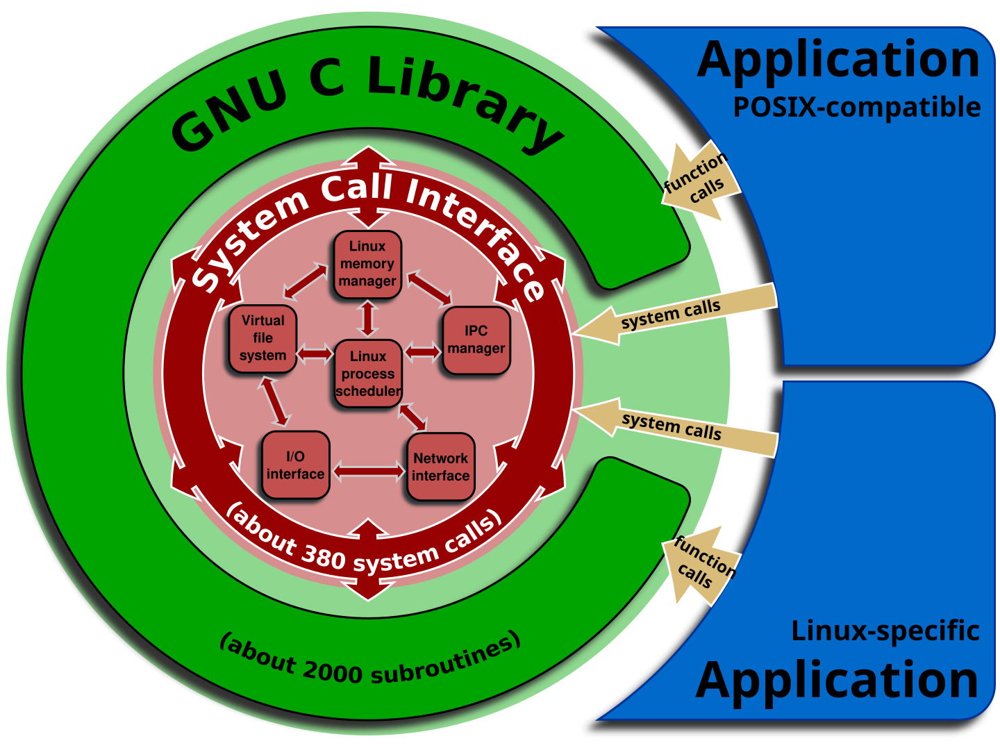
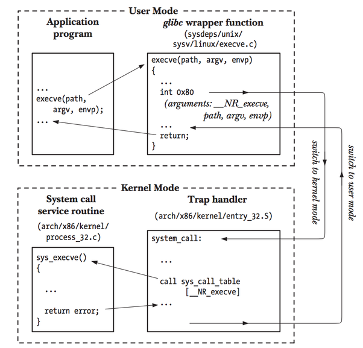

## 什麼是 Kernel？

一般指稱的 Linux 其實不是作業系統，而是 Kernel 的一種。 Kernel（內核），是處在硬體與軟體之間的程式，它主要負責分配硬體資源給軟體、控制硬體功能，同時把與硬體溝通的複雜流程簡化；相比之下，作業系統（Operating System），則是包含 Kernel 在內的大程式，加入許多面向一般使用者的應用程式、GUI 等等更多方便的功能。

為了安全， 作業系統（或者 CPU）會將程式分為兩種模式： user mode 與 kernel mode ，兩者分別在名為 user space 與 kernel space 的抽象空間中執行。其中在 kernel mode 下執行的程式擁有較大的權限，例如可以亂讀取別人的記憶體、執行一些特殊的 CPU 指令，通常來說，處在 user space 的程式是不被允許直接存取 kernel space 中的資料。因此，只要內核亂了你的電腦通常就會藍屏。
## 什麼是  System Call？

System Call（系統呼叫）是由系統內核開放給在 user space 程式的界面，可以想成一種內核開放出來的 public functions ，讓程式有辦法透過內核調度資源。

由此圖可以看見，外圍的程式，也就是處在用戶層的程式，不論是 C Library 或是其他應用，想要跟內核溝通都需要透過 System Call。

System Call 大致分為五類：
- Process Control
- File Management
- Device Management
- Information Maintenance
- Communication

比較常見的 System Call 應該是檔案讀寫，如 `read(2)` 、`write(2)` 就是 System Call 的一種，而在 C 中寫的 `fread(3)`、`fwrite(3)` 都是前二者的 wrapper。

> [!INFO] 括號內的數字
> 以 `read(2)` 為例，你可以打開終端機，打入 `man 2 read` ，就可以找到有關 `read` 函式的說明。 `man` 是系統提供的說明手冊指令，而 `2` 是手冊中的分區編號，包含 Kernel 提供的 System calls 說明。
## System Call 是怎麼實現的？

以前面的檔案讀寫為例，編譯包含 `read(2)` （或者呼叫 `fopen(3)` ）的程式所產生的 assembly code 會包含一條特殊的指令：`syscall` 。

System Call 的步驟如下：
1. 將要給此次 System Call 的參數推入 CPU Registers
2. 執行 `syscall` 指令，CPU 從 User Mode 換成 Kernel Mode
3. 將 Instruction Pointer 換到 Kernel 中的 System Call Handler（或 Trap Handler） 的地址
4. 將從原本 User Space 程式的狀態（Registers、Stack Pointer、Program Counter…）存到 Kernel Stack 中，等待之後取出
5. 根據指示的 Syscall Number ，透過 System Call Table 找到對應函式的地址
6. 執行 Syscall Function
7. 將執行結果推入特定的 CPU Register
8. 從 Kernel Stack 恢復程式狀態，執行 `sysret` 回到 User Mode

下圖展示了 System Call 的流程：


實際編譯出來的 Assembly Code：
```asm
section .data
    msg db "Hello, World!", 0xA     ; The string with a newline character
    msg_len equ $ - msg             ; Calculate length of the string

section .text
    global _start

_start:
    ; 1. sys_write (RAX = 1)
    mov rax, 1                      ; system call number for sys_write
    mov rdi, 1                      ; File descriptor 1: stdout
    mov rsi, msg                    ; Pointer to the message
    mov rdx, msg_len                ; Length of the message
    syscall                         ; Transfer control to the kernel

    ; 2. sys_exit (RAX = 60)
    mov rax, 60                     ; system call number for sys_exit
    mov rdi, 0                      ; Exit status code 0 (Success)
    syscall                         ; Transfer control to the kernel

```

而實際上的 C 程式碼可能就只是：
```c
#include <unistd.h>

int main() {
     char msg[] = "Hello, World!\n";
     size_t msg_len = sizeof(msg);
     ssize_t errno = write(1, msg, msg_len);
     return 0;
}
```
## References

[System Call (系統呼叫) - 從零開始的開源地下城](https://hackmd.io/@combo-tw/BJPoAcqQS)
[系統呼叫 - 維基百科，自由的百科全書](https://w.wiki/UuVs)

