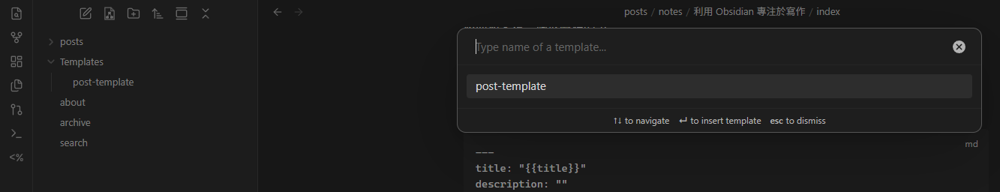
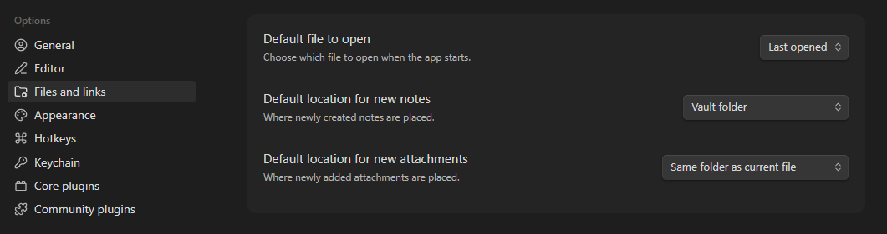
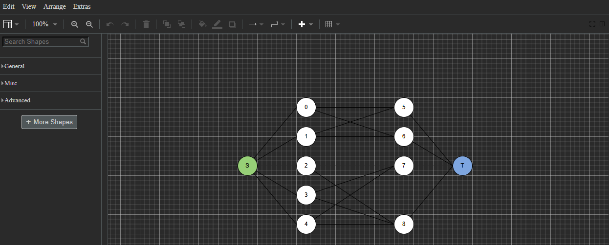
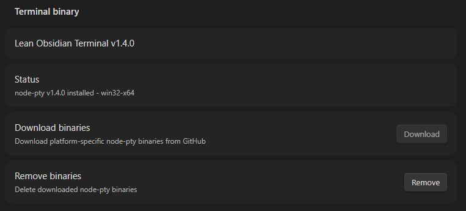

之前用 hugo 架站的其中諸多痛苦是，我需要用 Vscode 打開 repo 寫文章、開終端機跑 hugo、開 localhost 查看文章效果、放圖片要手動複製、要想 commit message （這大概是最痛苦的），要更新得開多個視窗來達成一件事，所以讓我很不想在上面寫文章。

那些成熟的部落格網站如 Medium 、Wordpress 我都使用過，不過 Medium 沒辦法很好的支援數學算式還有程式碼、 Wordpress 需要付費才有更多功能與更細緻的個人化，導致我最後還是回到手動架站。

後來我接觸到 Obsidian ，便想將這些功能融合到「只開 Obsidian 一個軟體便可寫作」，而如果要改變網頁架構或寫程式再開 Vscode 即可。做了點研究，發現 Obsidian 自帶的功能以及他龐大的社群插件能夠達成這個目標，故寫成文章記錄下來。
## 一般設定

我是直接將 `content` 當作 Vault，此外也需要更改 `.gitignore` 和 `hugo.yaml` 來忽略掉 Obsidian 創建的檔案。

- `.gitignore`：
```
content/.obsidian
```

- `hugo.yaml`：
```yaml
ignoreFiles:
  - '\/Templates\/.*'
  - '\\/\\.obsidian\\/.*$'
  - '\\.png$'
```
## Template
在寫文章時我也覺得每次要管理 Front Matter 很麻煩，況且許多文章用到的大部分 Properties 根本大同小異。我以往的做法是用 `hugo new posts/my-post.md` 這樣來創建新的 markdown 檔案，可想而知又是一個很麻煩的事。

而 Obsidian 有提供內建的 Template 功能：
1. 在 Vault 中建立一個資料夾，命名為 `Templates`
2. 在 `Templates/` 底下建立一個新的筆記，例如 `post-template.md`
3. 填入平時寫文章時的結構，以我的為範例：
```md
---
title: "{{title}}"
description: ""
summary:
date: "{{date}}"
categories:
tags:
draft: true
---
```

使用時，先創建一個空的 markdown 檔案，然後點擊左側工具欄的 "Insert Template" 並選擇剛剛創建的模板即可。


## 圖片管理
另外一個使用 Obsidian 的好處是，當你把圖片拖入 Obsidian 時，它能複製圖片到與文章相同的資料夾下，並自動創建連結。如此一來，便不用再將圖片放入 `statics` 然後手動存取。

要達成這點，需要設定 Obsidian 與了解 hugo 是如何管理文章的。
### 設定 Obsidian

開啟設定 → Files and links → Default locations for new attachments 改成 `Same folder as current file`。


也可以將 Default location for new notes 設定成 `Same folder as current file`。
### index.md 與 \_index.md

除了直接將文章放在 `content/posts` 底下，還可以有兩種方式（以 PaperMod 為例）：
1. 資料夾 + `_index.md`（建立子分類頁面）：在 `posts/` 下建立資料夾，並在裡面放一個 `_index.md` 檔案（內容可留空）。
   **好處：** 這被稱為 Branch Bundle ，讓 hugo 會去掃描該資料夾，方便管理與歸類不含圖片的純文字文章。例如，我將所有修課心得統一放在 `posts/course-review/` 資料夾下。
2. 資料夾 + `index.md`（建立獨立文章與資源包）：建立一個專屬資料夾，並在裡面新增一個 `index.md`（注意沒有前綴底線 `_`），將文章寫在 `index.md` 中。
   **好處：** 這被稱為 Leaf Bundle。它可以將與該文章相關的所有檔案（如圖片、PDF、附件等）統一存放在同一個資料夾內，讓內文直接引用相對路徑，方便管理。

更詳細的資訊可以見：[Page bundles](https://gohugo.io/content-management/page-bundles/)。

這樣設定後，在 Obsidia 內寫作時，只要遵循方法二，就可以直接將圖片拖入 Obsidian 內。也可以將方法一、二合體，在建立過 `_index.md` 的資料夾下再使用方法二，更好的將文章歸類。
## Quick Add
如果覺得創建資料夾 + `index.md` 很麻煩，則可以使用 [QuickAdd](https://community.obsidian.md/plugins/quickadd) 這個社群插件。
1. 開啟 設定 $\rightarrow$ QuickAdd
2. 在 Choices & Packages 下的 Add Choice 按鈕旁邊的文字框輸入名字（例如：`New Hugo Page Bundle`），類型選擇 Template，然後點擊 Add Choice
3. 點擊該項目旁邊的齒輪圖示進行設定：
    - Template Path：選擇剛剛的 `Templates/post-template.md`
    - File name format：開啟，並設定為：`{{VALUE}}/index`
    - Create in folder：開啟，可留空或指定根目錄
4. 並在 QuickAdd 設定頁面中，點擊 `New Hugo Page Bundle` 旁邊的閃電圖示（使其變成紫色），將它登錄為 Obsidian 命令
5. 開啟設定 $\rightarrow$ 快捷鍵 (Hotkeys)
6. 搜尋 `QuickAdd: New Hugo Page Bundle`，將它綁定為快捷鍵，我使用的是 `Alt + Shift + N`
## 繪圖

作為一名資工系學生，繪製各種簡單圖示是必備技能。一般來說，需要用其他軟體製圖再放到 Obsidian 內，非常不方便。

所以可以安裝 [Diagrams](https://community.obsidian.md/plugins/drawio-obsidian) 這個插件，他使用 draw.io 直接修改 .svg 檔案，非常好用。



就是暗色模式看不太清楚......
## 終端機

我安裝的是 [Lean Terminal](https://community.obsidian.md/plugins/lean-terminal) 這個插件，比較多人選擇是使用 Obsidian Terminal 插件，但他會額外創建一個視窗，很解。

安裝後到設定 $\to$ Lean Terminal 點擊 Download binaries 就完成了。


## Git

我使用 [Obsidian Git](https://community.obsidian.md/plugins/obsidian-git) ，並且到設定更改 commit message 為 `build: update content {{date}}`。此外也可以設定自動 commit + push，但我喜歡手動。