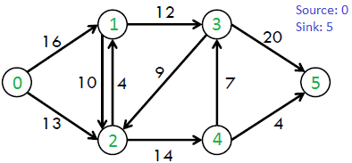
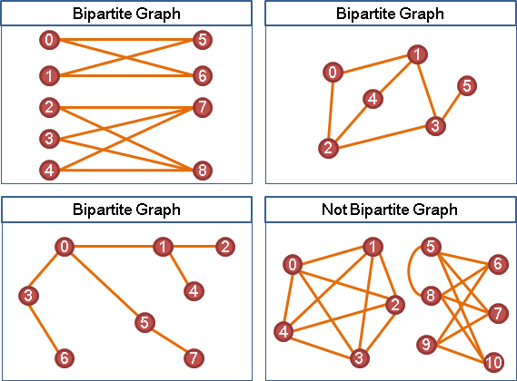

## 甚麼是最大流問題

想像有一張由水管連接而成的網路，每條水管有容量限制，流過的水流不能超過這條水管的容量。這張圖上有兩個特別的節點：**源點**和**匯點**，源點是無限供水的地方，而匯點是收集水的地方。


`source: https://www.geeksforgeeks.org/dsa/ford-fulkerson-algorithm-for-maximum-flow-problem/`

> **目標**：調整各條管線的流量，讓匯點 $T$ 能有最大輸入。

## 名詞介紹

- 網路 Network：一個有向圖
- 源點與匯點 Source and Sink：源點 $S$ 為網路流的起點、匯點 $T$ 為網路流的終點，其餘點為中間點
- 流量 Flow：每條邊上的數值，表示經過該條邊的流量，計為 $f(u,v)$
- 容量 Capacity ：每條邊上的最大流量，計為 $c(u,v)$
- 殘餘容量 Residual Capacity：每條邊上容量減去流量的值，計為 $r(u,v) = c(u,v) - f(u,v)$
- 剩餘網路 Residual Network：計算每條邊上的殘餘容量，以 $r(u,v)$ 畫成新的一張圖
- 網路流量：由源點出發至匯點的總流量，若該值達到最大，則稱為「最大流」
- 增廣路徑：在殘餘網路中，存在一條從源點 $S$ 到匯點 $T$ 的路徑，其路徑上的每一條邊殘餘容量皆大於 0（$r(u,v) > 0$），只要能找到增廣路徑，就代表當前的總流量還可以再增加
- 反向邊：殘餘網路還包含了反向邊，流量為 $f(u, v)$。反向邊的作用是給予演算法反悔的機制，當發現從不同路徑能夠達到的流量更大，且兩個路徑經過同一條邊但相反方向時，反向邊可以抵消原本的流量，讓兩條路徑分開為不同路徑，此時這條邊的實際流量就會是 0。

舉個反向邊的例子，考慮以下流量網路：

如果演算法先找到了 $S \rightarrow A \rightarrow B \rightarrow T$ 這條路徑，輸送了 10 單位的流量，此時 $A \rightarrow B$ 這條邊已經被占滿了。其實最佳解法應該是 $S \rightarrow B$ 與 $A \rightarrow T$ 這兩條路可以組出 $S \rightarrow B \rightarrow T$ 與 $S \rightarrow A \rightarrow T$ 這兩條路徑，可以組出 20 單位的流量，如果第一步時在 $A$ 、 $B$ 之間建立建立一條反向邊 $B \rightarrow A$ ，演算法就可以繼續走 $S \to B \to A \to T$。此時從 $A \to B$ 的流被抵銷了，兩條路徑被拆成都不經過 $A \to B$ 這條邊。
## 兩大基本約束

1. 容量限制：每條邊的實際流量不可超過容量，$0 \le f(u, v) \le c(u, v)$。
2. 流量守恆：除了源點 $s$ 和匯點 $t$ 外，任何中間節點流入的總水量必須等於流出的總水量。
## 最大流最小割定理
### 最小割
在一張流量網路圖 $G$ 中，有節點集合 $V$ 和邊集合 $E$ 。如果我們隨意挑選兩個節點集合 $S_1$ 與 $S_2$ ，使得源點在 $S_1$ 中、匯點在 $S_2$ 中，且 $S_1$ 與 $S_2$ 包含所有節點、兩者不相交，即 $S_1 \cup S_2 = V, S_1 \cap S_2 = \emptyset$。

現在挑一些邊組成一個集合 $A$ ，如果網路 $G$ 去掉 $A$ 中的邊使得 $S_1$ 與 $S_2$ 成兩個獨立、不相交的子圖，則稱 $A$ 是 $S_1$ 與 $S_2$ 的割集。而若 $A$ 只包含達成這個目的所需要的邊，不含有多餘的邊，那麼 $A$ 會被稱作「最小子集」。

現在加總 $A$ 中各邊的容量，如果這個容量達到所有可能的 $A$ 中的最小值，則稱 $A$ 為網路 $G$ 的「最小割」。
### 最大流最小割

最大流最小割定理說明對於一個網路 $G$ 來說，下面三者相等：
1. 一個流 $F$ 為 $G$ 的最大流
2. $G$ 的殘餘網路中沒有 $F$ 的增廣路徑
3. 存在一個割 $A$，其容量為 $F$ 的流量

如果能從圖 $G$ 中還找到增廣路，則說明 $F$ 不是最大流，反之亦然，因此前兩者等價。

而第三點的割 $A$ ，就會是 $G$ 的最小割。簡單來說，不管水怎麼流，流量絕對不可能超過任何一個瓶頸（割）的極限能力。因此當我們找到最小的那個瓶頸時，流量一定會受限於那個瓶頸的上限，所以流量會是最大流。

因此最大流最小割定理就是在說，找到網路中的最小割與找到最大流是同一件事。

## 解決最大流問題：Dinic's Algorithm

Dinic 演算法是解決網路最大流問題的高效演算法。它結合 BFS 與 DFS，利用「分層圖」與「當前邊優化」一次性找出多條增廣路徑，達成在一般圖有 $O(V^2E)$ 的時間複雜度、在單位容量圖有 $O(E\sqrt{V})$ 的複雜度。

Dinic 演算法的核心思想大概是：
1. 使用 BFS ，在 $r(u,v)>0$ 的邊上，基於節點與源點的距離建立層次網路
2. 在層次網路的基礎上用 DFS 找一條從源點到匯點的路徑，並計算上面的瓶頸，再更新路徑上的正向和反向邊
3. 繼續執行 2 直到這個層次網路中找不到源點到匯點的路徑，此時找到的加總流量會稱為**阻塞流**
4. 回到 1 重新建立層次網路

如果寫成虛擬碼就是：
```
total_flow = 0
while bfs can build level map:
    while dfs can find more flow:
        total_flow += the flow dfs found
return total_flow
```

舉個例子，先看看下面的網路：

通過所有 $r(u,v)>0$ 的邊，我們可以知道從 $S$ 到 $A$、$B$ 要一步，從 $S$ 到 $T$ 要兩步，因此：
- 第 0 層： $S$
- 第 1 層： $A$、$B$
- 第 2 層： $T$

現在 DFS 限制只能走到當前 level + 1 的節點上，因此會有兩條路徑：$S \to A \to T$ 與 $S \to B \to T$。
1. 路徑 $S \to A \to T$
	- 瓶頸 : $S \to A$ 是 10 ; $A \to T$ 是 5，取最小值 **5**
	- 更新殘餘容量：$S \to A$ 剩下 5；$A \to T$ 剩下 0
	- 目前總流量 : **5**
2. 路徑 $S \to B \to T$
	- 瓶頸 : $S \to B$ 是 5 ; $B \to T$ 是 10，取最小值 **5**
	- 更新殘餘容量：$S \to B$ 剩下 0；$B \to T$ 剩下 5
	- 目前總流量 : **10**

因為找不到其他可行的路徑，所以再一次利用 BFS 建立層次網路，現在殘餘網路變成這樣（別忘了反向邊）：

因為我們只要尋找 $r(u,v) > 0$ 的邊，所以層次圖現在是：
- 第 0 層： $S$
- 第 1 層： $A$
- 第 2 層： $B$
- 第 3 層： $T$

且只有一條合法的路徑：$S \to A \to B \to T$。

1. 路徑 $S \to A \to B \to T$
	- 瓶頸 : $S \to A$ 是 5 ; $A \to B$ 是 5；$B \to T$ 是 5，取最小值 **5**
	- 更新殘餘容量：$S \to A$ 剩下 0；$A \to B$ 剩下 0；$B \to T$ 剩下 0
	- 目前總流量 : **15**


至此 BFS 不能再建立從 $S$ 到 $T$ 的分層圖，所以就結束了。

此外 Dinic 也有對 DFS 進行優化：對於每個節點的出邊，只會掃描一次。

在同一個分層圖的多輪 DFS 過程中，算法會頻繁地重新訪問同一個點 $u$。若點 $u$ 的前 $k$ 條邊已經被之前的 DFS 嘗試過且殘量已耗盡（或者無法再連通到 $t$），那麼後續的 DFS 再次來到點 $u$ 時，不需要重新檢查這前 $k$ 條無效的邊。

可以使用一個指標陣列 `ptr[u]` 記錄點 $u$ 當前處理到哪一條邊。DFS 下一次訪問 $u$ 時直接從 `ptr[u]` 開始探索，已經試過的邊直接略過。

Sample Code:
```cpp
#define MAXN 10005
#define ll long long
#define INF 1e18

struct edge {
    int to;
    ll cap;
    int rev; // 反向邊在 mat[to] 的 index
};

vector<edge> mat[MAXN];

void add_edge(int from, int to, ll cap) {
    // 此時反向邊將會插在 mat[to] 的末尾，也就是位置 mat[to].size()
    mat[from].push_back({to, cap, (int)mat[to].size()});
    // 此時正向邊剛好插在 mat[from] 的最後一個位置，即 mat[from].size() - 1
    mat[to].push_back({from, 0, (int)mat[from].size() - 1});
}

int level[MAXN];
bool bfs(int s, int t) {
    fill(level, level + MAXN, -1);
    queue<int> q;
    q.push(s);
    level[s] = 0;

    while (!q.empty()) {
        int curr = q.front();
        q.pop();

        for (const edge& e : mat[curr]) {
            // 沒有設定過 level (未被訪問過)或者剩餘容量為 0 者跳過
            if (level[e.to] < 0 && e.cap > 0) {
                level[e.to] = level[curr] + 1;
                q.push(e.to);
            }
        }
    }

    return level[t] >= 0; // bfs 可以抵達匯點
}

int ptr[MAXN];
ll dfs(int curr, int t, ll flow) {
    if (curr == t || flow == 0) return flow;

    // 紀錄上次走過的邊
    for (int& i = ptr[curr]; i < (int)mat[curr].size(); i++) {
        edge& e = mat[curr][i];

        // level 不等於當前 level + 1 或者剩餘容量為 0 者跳過
        if (e.cap <= 0) continue;
        if (level[e.to] != level[curr] + 1) continue;

        int d = dfs(e.to, t, min(flow, e.cap));  // 更新瓶頸
        if (d > 0) {
            e.cap -= d;
            mat[e.to][e.rev].cap += d;  // 更新反向邊
            return d;
        } 
    }

    return 0;
}

// 計算從源點 s 到匯點 t 的最大流
ll max_flow(int s, int t) {
    ll flow = 0;
    while (bfs(s, t)) {
        fill(ptr, ptr + MAXN, 0);
        while (ll f = dfs(s, t, INF)) {
            flow += f;
        }
    }
    return flow;
}
```
## 二分圖問題
### 甚麼是二分圖(Bipartite Graph)

簡單來說，一張圖 $G$ 的節點可以分成兩個集合 $L$ 與 $R$ ，且兩集合的內部節點沒有邊互相連結，也就是說，所有邊只存在在兩集合的節點之間，這種圖就稱為二分圖。需要用到二分圖的題目的難點通常是難以看出題目要用二分圖。


`source: https://web.ntnu.edu.tw/~algo/BipartiteGraph.html`

### 二分圖最大匹配問題
二分圖最大匹配問題說的是，給定一張二分圖，若 $L$ 與 $R$ 的兩節點 $A \in L$ 、 $B \in R$ 之間，可以透過一條邊連結形成配對，那麼最多可以配對多少對節點？

通俗一點的講法是， $L$ 是班上男生、 $R$ 是班上女生，且邊代表兩者間的好感關係，現在作為愛神的你最多可以湊成幾對班對？（沒有三角戀或者同性戀）

傳統的算法如匈牙利算法需要 $O(N^3)$ 計算，而用最大流可以有更好的複雜度。
### 如何將二分圖問題轉成最大流問題
1. 建立超級源點 $S$ 、超級匯點 $T$
2. $S$ 連接到在 $L$ 中的所有節點，邊的容量設成 $1$
3. $T$ 連接到在 $R$ 中的所有節點，邊的容量設成 $1$
4. 將 $L$ 與 $R$ 之間的邊的容量設成 $1$

思考一下，從 $S$ 出去到一個 $L$ 中的節點 $A$ 只有 1 個單位的流量，那麼 $A$ 最多只能轉移 $1$ 單位流量到 $R$ 中的節點 $B$ ，也就是只配對一個對象 $A \to B$，此時 $T$ 所接收到的流量就是配對數。因此，找該圖的最大流就是找到該二分圖的最大匹配數，在這種圖上， Dinic 算法的效率是 $O(E\sqrt{V})$ 。

如果一個節點可以配對到許多個（如 $n$ 個）節點，只要修改 $S$ 到 $L$ 中節點的邊、$R$ 到 $T$ 的邊的容量為 $n$ 就好。


## Reference
https://yuncolorblog.com/posts/%E7%AB%B6%E7%A8%8B%E7%AD%86%E8%A8%98/dinics-algorithm/
https://web.ntnu.edu.tw/~algo/Flow.html
https://hackmd.io/@ShanC/maxflow-mincut-theorem