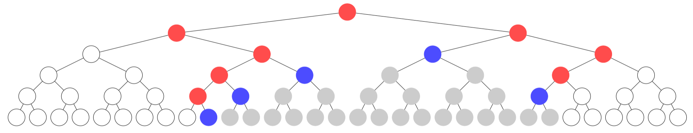

線段樹是一種資料結構，也可以說是一種分冶想法，用來在 $O(\log N)$ 內處理區間查詢、區間修改的問題。
## 甚麼是區間問題

比較簡單的區間問題如下：

> 有一個序列 $a_1, a_2, a_3, \cdots, a_n$ ，且有 $q$ 筆操作，操作有兩種：
> 1. 查詢：給定一個範圍 $[l, r]$ ，求該範圍的最大值
> 2. 修改：給定一個範圍 $[l, r]$ ，把該範圍內的元素加上 $x$

可以很容易想到暴力法：遍例區間內的元素，對每個元素進行操作。顯然這種方法的時間複雜度是 $O(qn)$ ，在 $q$ 、 $n$ 較大時不可行。

## 線段樹的思想

如果我們可以維護特定大小區間的訊息，然後將兩個相鄰區間的訊息合併出更大區間的訊息，便可將時間複雜度降至 $O(\log n)$。

以上述例子來看，對於一個區間 $[l, r]$ 來說，如果已知左半部的最大值， 也就是 $[l, \lfloor (l + r) / 2 \rfloor]$ 的最大值，和右半部的最大值，也就是 $[\lfloor (l + r) / 2 \rfloor + 1, r]$ ，那麼就可以得知大區間 $[l, r]$ 的最大值是左右半部中的較大者。

舉個例子，假設陣列是 `A = {1, 1, 2, 6}` ，如果想要知道整個陣列的最大值，可以先計算 `A[0]~A[1]` 的最大值與 `A[2]~A[3]` 的最大值，然後合併起來取兩者較大者。

將這些區間用節點表示，那麼較大區間的子區間可以是該節點的子節點。眾所周知，電腦科學家最喜歡 2 這個數字了，因此可以將這些節點以一棵二元樹表示。

`source: https://cp.wiwiho.me/segment-tree/`
## 建構線段樹

以下所有區間都是包含左右端點，中點是 $M = \lfloor \frac{L + R}{2} \rfloor$ ，左半區間為 $[L, M]$ ；右半區間為 $[M + 1, R]$，且範例使用以上面的區間問題為例。

儲存線段樹的方法是使用類似 heap 那樣的完全二元樹，也就是除了最後一層外每個節點都有兩個子節點。在這種架構下，可以利用陣列儲存這棵樹，並且很輕鬆的找出每個節點的左右子節點。為了方便，讓陣列的編號從 1 開始，左子節點編號為 $2i$ ， 右子節點為 $2i + 1$。

```cpp
#define MAXN
#define left(i) (2 * i)
#define right(i) (2 * i + 1)

typedef struct {
	int mx; // 該區間的最大值
} Node;

int arr[MAXN + 1]; // 原陣列，為了方便採用 1-indexed
vector<Node> seg(4 * MAXN); // 線段樹陣列

// 建構包含 [L, R] 區間的線段樹，目前在 seg[curr] 這個節點
void build(int L, int R, int curr) {
    if (L == R) {
        seg[curr].mx = arr[L];
        return;
    }
    
    int M = (L + R) / 2;
    build(L, M, left(curr));
    build(M + 1, R, right(curr));

    // 建構完兩個子節點後，更新自身資訊
    seg[curr].mx = max(seg[left(curr)].mx, seg[right(curr)].mx);
}
```

我覺得要學會線段樹首先要不搞混「區間」和「樹上編號」這兩個東西，「區間」指的是在原陣列上的一個範圍；而「樹上編號」指的是，我們為了方便而用陣列儲存線段樹的樹上節點編號，另外，節點是不需要儲存左右子節點在哪裡的。

如果有注意到，線段樹陣列自身開點只到 $4N$ 而已。為甚麼呢？

可以想像一顆節點數量被完全補滿的二元樹（叫做 Perfect Binary Tree），此時假設他的樹高為 $h$ ，那麼節點數量就是 $2^{h} - 1$ 了。

另一方面，我們也可以從陣列長度量推出樹高，假設陣列長度是 $N$ ，那麼樹高就會是 $\lceil \log_2{N} \rceil + 1$ 。再假設如果這個陣列剛好可以建出一顆完全補滿的線段樹，根據剛剛的推導，樹的節點數量會是 $2^{\lceil \log_2{N}\rceil + 1} - 1$ ，而樹高又滿足不等式 $\lceil \log_2{N} \rceil < \log_2{N} + 1$，帶入的話會發現：
$2^{\lceil \log_2{N} \rceil + 1} - 1 < 2^{\log_2{N} + 1 + 1} - 1 = 4 \times N - 1 < 4N$

因此節點數量最多會到 $4N$ 而已。
## 查詢線段樹

```cpp
// 查詢 [l, r] 區間的最大值
// 目前實際搜尋範圍是 [L, R] 且在 seg[curr] 這個節點
int query(int l, int r, int L, int R, int curr) {
    if (l <= L && R <= r) {
        // 在 [L, R] 內的資訊都是需要的，直接回傳
        return seg[curr].mx;
    }

    int M = (L + R) / 2;
    if (r <= M) { // 全在左半區間
        return query(l, r, L, M, left(curr));
    } else if (l > M) { // 全在右半區間
        return query(l, r, M + 1, R, right(curr));
    } else { // [l, r] 橫跨中點
        return max(query(l, r, L, M, left(curr)),
                   query(l, r, M + 1, R, right(curr)));
    }
}
```
## 懶人標記 (Lazy Tag)

剛剛並沒有提到如何在 $O(\log N)$ 內區間修改，如果每次修改都還是花上 $O(N)$ ，那麼還是有可能 TLE，所以要引入一個概念叫做懶人標記。

Lazy Tag 的想法是，只有真正要讀取到那個節點的時候，才去修改那個節點的資訊，其餘時間只修改該節點的父節點（或更上面的節點）。這種推遲修改的手法，讓修改這件事情可以隨著樹上的邊傳播，而樹高最多是 $O(\log N)$ ，因此時間複雜度也是 $O(\log N)$。

舉例來說，假設陣列是 `A = {1, 1, 2, 6}`，現在想要將所有元素的值都加上 $20$ ，然後求整個陣列的最大值，這樣需要修改所有元素嗎？答案是不必，因為我們沒有真正要存取每個元素值，只需要修改線段樹根節點所儲存的最大值，把它改成 $6 + 20 = 26$ 就好。當後續查詢整個陣列的最大值時，還是只會讀取根節點，所以資訊仍然是對的。

節點儲存的資訊變更成：
```cpp
typedef struct {
	int mx; // 該區間的最大值
	int tag; // 修改增加/減少的值
} Node;
```
### Tag & Push & Pull

首先介紹如何給節點打上標記，在打上標記（紀錄要修改的值）的同時，也更新節點的資訊。

```cpp
void add_tag(int id, int tag) {
    seg[id].mx += tag; // 更改節點資訊
    seg[id].tag += tag; // 注意本來就可能有標記了
}
```

而 Push 操作的意思是，準備要存取子節點時，將自己的 tag 推給子節點，這樣就可以更新子節點的資訊。

```cpp
// 更新子節點資訊並把標記移到子節點身上  
void push(int id){  
    add_tag(left(id), seg[id].tag);
    add_tag(right(id), seg[id].tag);
    seg[id].tag = 0; // 清除自身標記
}
```

Pull 的意思其實跟標記不太有關係，他是根據兩個子節點的資訊更新自己的資訊。

```cpp
// 根據兩個子節點的資訊更新自己的資訊
void pull(int id) {
	seg[id].mx = max(seg[left(id)].mx, seg[right(id)].mx);
}
```
### 修改

因此修改時，如果實際處理區間被修改區間包住，就可以直接在該節點打上標記。如果沒有，我們就可以先將標記推給子節點，再讓子節點處理懶人標記的邏輯。注意推到子節點身上後，因為我們並沒有給自身打標記，所以自己的資訊也要更新。

```cpp
void modify(int l, int r, int L, int R, int curr, int tag) {
	if (l <= L && R <= r) { // 完全覆蓋，直接打標記
	    add_tag(curr, tag);
	    return;
	}
	push(curr); // 因為要處理子節點，所以推標記給子節點
	
	int M = (L + R) / 2;
	if (r <= M) { // 全在左半區間
	    modify(l, r, L, M, left(curr), tag);
	} else if (l > M) { // 全在右半區間
	    modify(l, r, M + 1, R, right(curr), tag);
	} else { // [l, r] 橫跨中點
	    modify(l, r, L, M, left(curr), tag);
	    modify(l, r, M + 1, R, right(curr), tag);
	}
	pull(curr); // 當子節點更新完時，再更新自身標記
}
```

### 查詢

查詢時，如果要存取更深層節點的資訊，就需要將標記推送下去，因此查詢操作會是：
```cpp
int query(int l, int r, int L, int R, int curr) {
    if (l <= L && R <= r) {
        return seg[curr].mx;
    }
    push(curr); // 無法直接回傳，需要存取更深層節點
    
    int M = (L + R) / 2;
    if (r <= M) { // 全在左半區間
        return query(l, r, L, M, left(curr));
    } else if (l > M) { // 全在右半區間
        return query(l, r, M + 1, R, right(curr));
    } else { // [l, r] 橫跨中點
        return max(query(l, r, L, M, left(curr)),
                   query(l, r, M + 1, R, right(curr)));
    }
}
```

## Full Sample Code

```cpp
#include <bits/stdc++.h>
#define MAXN 1000000
#define left(i) (2 * i)
#define right(i) (2 * i + 1)

using namespace std;

typedef struct {
	int mx; // 該區間的最大值
	int tag; // 修改增加/減少的值
} Node;

int arr[MAXN + 1]; // 原陣列，為了方便採用 1-indexed
vector<Node> seg(4 * MAXN); // 線段樹陣列

void add_tag(int id, int tag) {
    seg[id].mx += tag; // 更改節點資訊
    seg[id].tag += tag; // 注意本來就可能有標記了
}

// 更新子節點資訊並把標記移到子節點身上  
void push(int id){  
    add_tag(left(id), seg[id].tag);
    add_tag(right(id), seg[id].tag);
    seg[id].tag = 0; // 清除自身標記
}

// 根據兩個子節點的資訊更新自己的資訊
void pull(int id) {
	seg[id].mx = max(seg[left(id)].mx, seg[right(id)].mx);
}

// 建構包含 [L, R] 區間的線段樹，目前在 seg[curr] 這個節點
void build(int L, int R, int curr) {
    if (L == R) {
        seg[curr].mx = arr[L];
        return;
    }
    
    int M = (L + R) / 2;
    build(L, M, left(curr));
    build(M + 1, R, right(curr));
    
    // 建構完兩個子節點後，更新自身資訊
    pull(curr);
}

void modify(int l, int r, int L, int R, int curr, int tag) {
	if (l <= L && R <= r) { // 完全覆蓋，直接打標記
	    add_tag(curr, tag);
	    return;
	}
	push(curr); // 因為要處理子節點，所以推標記給子節點
	
	int M = (L + R) / 2;
	if (r <= M) { // 全在左半區間
	    modify(l, r, L, M, left(curr), tag);
	} else if (l > M) { // 全在右半區間
	    modify(l, r, M + 1, R, right(curr), tag);
	} else { // [l, r] 橫跨中點
	    modify(l, r, L, M, left(curr), tag);
	    modify(l, r, M + 1, R, right(curr), tag);
	}
	pull(curr); // 當子節點更新完時，再更新自身標記
}

int query(int l, int r, int L, int R, int curr) {
    if (l <= L && R <= r) {
        return seg[curr].mx;
    }
    push(curr); // 無法直接回傳，需要存取更深層節點
    
    int M = (L + R) / 2;
    if (r <= M) { // 全在左半區間
        return query(l, r, L, M, left(curr));
    } else if (l > M) { // 全在右半區間
        return query(l, r, M + 1, R, right(curr));
    } else { // [l, r] 橫跨中點
        return max(query(l, r, L, M, left(curr)),
                   query(l, r, M + 1, R, right(curr)));
    }
}

int main() {
    int n, q;
    cin >> n >> q;
    
    for (int i = 1; i <= n; i++) {
        cin >> arr[i];
    }
    
    build(1, n, 1); // 建構 [1, n] 區間，從 root (編號為1) 開始操作
    
    while (q--) {
        string opr;
        cin >> opr;
        if (opr == "query") {
            int l, r;
            cin >> l >> r;
            // 查詢 [l, r] 區間最大值，從 root (編號為1) 開始操作
            cout << query(l, r, 1, n, 1) << "\n";
        } else if (opr == "modify") {
            int l, r, x;
            cin >> l >> r >> x;
            // 給 [l, r] 區間加上 x，從 root (編號為1) 開始操作
            modify(l, r, 1, n, 1, x);
        }
    }
}

```

## References
https://cp.wiwiho.me/segment-tree/